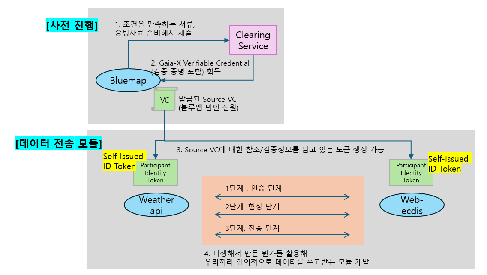
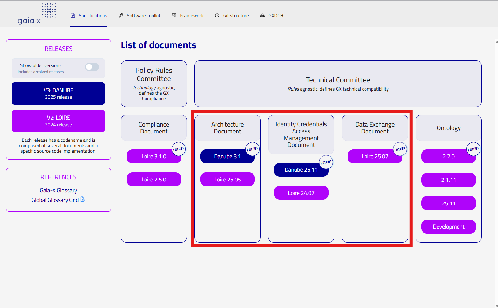

# Gaia-X 기반 데이터 전송 모듈



> **출처**: [Gaia-X Official Documentation](https://docs.gaia-x.eu/#/)  
> Gaia-X Trust Framework 및 공식 기술 규격을 준수하여 개발합니다.

## 개요

Bluemap이 Gaia-X Clearing Service로부터 **Verifiable Credential(VC)** 을 발급받고, 이를 기반으로 참여자 간 **Self-Issued ID Token**을 생성하여 **인증 → 협상 → 전송** 3단계 프로토콜을 수행하는 데이터 전송 모듈입니다.

## 디렉토리 구조

```
├── demo/           # 데이터 전송 모듈 (개발 중)
└── official-docs/  # Gaia-X 공식 문서 한국어 번역 및 링크
```

---

## 공식 문서 참조 (Official Docs)



[docs.gaia-x.eu](https://docs.gaia-x.eu/#/) Technical Committee 문서 중 아래 3종을 번역·참조합니다.

---

### 01 - Architecture Document

*(번역 준비 중)*

---

### 02 - Identity Credentials Access Management Document

| 섹션 | EN | KO |
|------|:--:|:--:|
| About | [📄](official-docs/02-Identity%20Credentials%20Access%20Management%20Document/0_About/Identity,%20Credential%20and%20Access%20Management%20Document.md) | [📄](official-docs/02-Identity%20Credentials%20Access%20Management%20Document/0_About/Identity,%20Credential%20and%20Access%20Management%20Document%20ko.md) |
| Adopted Standards and Protocols | [📄](official-docs/02-Identity%20Credentials%20Access%20Management%20Document/1_Adopted%20Standards%20and%20Protocols/Adopted%20Standards%20and%20Protocols.md) | [📄](official-docs/02-Identity%20Credentials%20Access%20Management%20Document/1_Adopted%20Standards%20and%20Protocols/Adopted%20Standards%20and%20Protocols%20ko.md) |
| Digital Identities | [📄](official-docs/02-Identity%20Credentials%20Access%20Management%20Document/2_Digital%20Identities/Digital%20Identities.md) | [📄](official-docs/02-Identity%20Credentials%20Access%20Management%20Document/2_Digital%20Identities/Digital%20Identities%20ko.md) |
| Gaia-X Credentials | [📄](official-docs/02-Identity%20Credentials%20Access%20Management%20Document/3_Gaia-X%20Credentials/Gaia-X%20Credentials.md) | [📄](official-docs/02-Identity%20Credentials%20Access%20Management%20Document/3_Gaia-X%20Credentials/Gaia-X%20Credentials%20ko.md) |
| ICAM Semantic Model | [📄](official-docs/02-Identity%20Credentials%20Access%20Management%20Document/4_ICAM%20Semantic%20Model/ICAM%20Semantic%20Model.md) | [📄](official-docs/02-Identity%20Credentials%20Access%20Management%20Document/4_ICAM%20Semantic%20Model/ICAM%20Semantic%20Model%20ko.md) |
| Changelog | [📄](official-docs/02-Identity%20Credentials%20Access%20Management%20Document/5_Changelog/Changelog.md) | [📄](official-docs/02-Identity%20Credentials%20Access%20Management%20Document/5_Changelog/Changelog%20ko.md) |

---

### 03 - Data Exchange Document

| 섹션 | EN | KO |
|------|:--:|:--:|
| Editorial Information | [📄](official-docs/03-Data%20Exchange%20Document/0_Editorial%20Information/Data%20Exchange%20Document%20-%2025.07%20Release.md) | [📄](official-docs/03-Data%20Exchange%20Document/0_Editorial%20Information/Data%20Exchange%20Document%20-%2025.07%20Release%20ko.md) |
| Introduction | [📄](official-docs/03-Data%20Exchange%20Document/1_Introduction/Introduction.md) | [📄](official-docs/03-Data%20Exchange%20Document/1_Introduction/Introduction%20ko.md) |
| Data Product | [📄](official-docs/03-Data%20Exchange%20Document/2_Data%20Product/Data%20Product.md) | [📄](official-docs/03-Data%20Exchange%20Document/2_Data%20Product/Data%20Product%20ko.md) |
| Data Exchange Services | [📄](official-docs/03-Data%20Exchange%20Document/3_Data%20Exchange%20Services/Data%20Exchange%20Services.md) | [📄](official-docs/03-Data%20Exchange%20Document/3_Data%20Exchange%20Services/Data%20Exchange%20Services%20ko.md) |
| Data Products Catalogue | [📄](official-docs/03-Data%20Exchange%20Document/4_Data%20Products%20Catalogue/Data%20Products%20Catalogue.md) | [📄](official-docs/03-Data%20Exchange%20Document/4_Data%20Products%20Catalogue/Data%20Products%20Catalogue%20ko.md) |
| Data Access Logging | [📄](official-docs/03-Data%20Exchange%20Document/5_Data%20Access%20Logging/Data%20Access%20Logging.md) | [📄](official-docs/03-Data%20Exchange%20Document/5_Data%20Access%20Logging/Data%20Access%20Logging%20ko.md) |
| Data Usage Agreement | [📄](official-docs/03-Data%20Exchange%20Document/6_Data%20Usage%20Agreement/Data%20Usage%20Agreement.md) | [📄](official-docs/03-Data%20Exchange%20Document/6_Data%20Usage%20Agreement/Data%20Usage%20Agreement%20ko.md) |
| Policies | [📄](official-docs/03-Data%20Exchange%20Document/7_Policies/Policies.md) | [📄](official-docs/03-Data%20Exchange%20Document/7_Policies/Policies%20ko.md) |
| Annex 1 - Ontologies | [📄](official-docs/03-Data%20Exchange%20Document/8_Annex%201%20-%20Ontologies/Annex%201%20-%20Ontologies.md) | [📄](official-docs/03-Data%20Exchange%20Document/8_Annex%201%20-%20Ontologies/Annex%201%20-%20Ontologies%20ko.md) |
| Annex 2 - Data Exchange example | [📄](official-docs/03-Data%20Exchange%20Document/9_Annex%202%20-%20Data%20Exchange%20example/Annex%202%20-%20Data%20Exchange%20example.md) | [📄](official-docs/03-Data%20Exchange%20Document/9_Annex%202%20-%20Data%20Exchange%20example/Annex%202%20-%20Data%20Exchange%20example%20ko.md) |
| Changelog | [📄](official-docs/03-Data%20Exchange%20Document/10_Changelog/Changelog.md) | [📄](official-docs/03-Data%20Exchange%20Document/10_Changelog/Changelog%20ko.md) |
