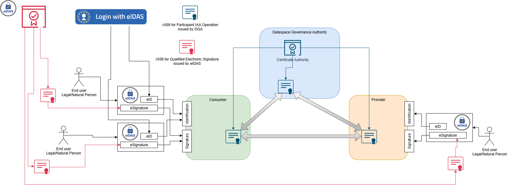

# 4. Digital Identities[¶](https://docs.gaia-x.eu/technical-committee/identity-credential-access-management/25.11/digital_identities/#digital-identities "Permanent link")

## 4.1 Overview[¶](https://docs.gaia-x.eu/technical-committee/identity-credential-access-management/25.11/digital_identities/#overview "Permanent link")

Digital identity consists of the digital attributes and credentials that an entity (such as a person, organisation, or service) uses for authentication, authorisation, and trusted access to resources.
A digital identity may be represented by one or more verifiable credentials issued by trusted parties, encoding claims about the identity subject.
Each digital identity is anchored with a cryptographic key pair: the private key remains under the holder’s control, while the corresponding public key—typically published through a verification method within a DID Document—enables others to verify signatures and authenticate issuers.

Within an ecosystem, every issued credential must link the issuer’s identity to the subject’s unique identity. The Ecosystem Governance Authority defines the authorised credential types, identity categories, and permitted operations within the trust framework.

The following section outlines how different types of key pairs and trust levels are applied within the ecosystem to support identity and credential operations.

## 4.2 Operational Roles of Digital Identities and Key pair Usage[¶](https://docs.gaia-x.eu/technical-committee/identity-credential-access-management/25.11/digital_identities/#operational-roles-of-digital-identities-and-key-pair-usage "Permanent link")

Within the ecosystem, digital identities serve distinct purposes. Identities issued by the Ecosystem Governance Authority during onboarding support Identification, Authentication, and Authorisation (IAA) operations, such as secure intra-agent communication and policy enforcement.
Identities used for electronic identification (eID) and electronic signatures enable trusted transactions, with assurance levels defined by the governance authority. eID services may also simplify participant verification during onboarding.

The workflow diagram below illustrates how digital identities can be used to sign credentials, how they connect to Trust Service Providers, and how verification methods are linked across the ecosystem architecture.

*Figure 4.2 - Use of Digital Identities*

Depending on the use case, key pairs may be self-issued, pseudonymous (not linked to a verified identity), or certified by a Trust Service Provider (TSP); different TSPs can be engaged according to assurance or regulatory needs.

### 4.2.1 Self-certified identifiers[¶](https://docs.gaia-x.eu/technical-committee/identity-credential-access-management/25.11/digital_identities/#self-certified-identifiers "Permanent link")

Valid cryptographic key pairs may exist without being bound to a certificate or an explicit identifier of a person or entity. For example, a DID Key can serve as a verification method: it identifies the public key and algorithm, and allows the subject to present claims linked to that key when required.

### 4.2.2 Self-signed certificates[¶](https://docs.gaia-x.eu/technical-committee/identity-credential-access-management/25.11/digital_identities/#self-signed-certificates "Permanent link")

In this model, entities create and sign their own X.509 certificates rather than obtaining them from a third-party Certificate Authority. This represents a lower level of external trust assurance compared to Trust Service Provider-issued certificates. The ecosystem’s governance authority defines which identity types and contexts may rely on self-signed certificates within the trust framework.

### 4.2.3 Trust Service Provider (TSP) Keypair[¶](https://docs.gaia-x.eu/technical-committee/identity-credential-access-management/25.11/digital_identities/#trust-service-provider-tsp-keypair "Permanent link")

In this case, a qualified trust service provider issues a certificate and provides a qualified signature device (or hardware-protected private key) which ensures non-direct access to the private key. Because the TSP conducts know-your-customer / know-your-business (KYC/KYB) checks and maintains revocation mechanisms, the certificate is considered authentic and valid. The TSP or issuing certificate authority publishes endpoints (such as certificate revocation lists or OCSP) that verifiers may query to validate status.

## 4.3 Binding Digital Identities to Claims[¶](https://docs.gaia-x.eu/technical-committee/identity-credential-access-management/25.11/digital_identities/#binding-digital-identities-to-claims "Permanent link")

When an issuer provides a claim, the issuer’s digital identity MUST be verified to ensure that the claim originates from a trusted and authorized source.
Issuers using verified digital identities SHOULD comply with the eligibility and assurance requirements defined by the ecosystem’s governance framework.
When X.509 certificates are legally recognized and bound to verified legal identities, signatures on issued claims elevate assurance and legal value for relying parties, especially when the issuer is recognised in the ecosystem Registry and exposes CRL/OCSP for status.

For example, when a digital contract is represented as a verifiable credential, signing it with a qualified digital identity (e.g., a legally recognised electronic signature) provides it with legal enforceability.

Verified claims are then evaluated by access control engines (e.g., policy decision points) to authorise participant actions and resource access.

### 4.3.1 Different Requirements Based on Use Cases[¶](https://docs.gaia-x.eu/technical-committee/identity-credential-access-management/25.11/digital_identities/#different-requirements-based-on-use-cases "Permanent link")

Requirements for digital identities vary depending on the use case and ecosystem context.

**Example: University Scenario:**
In a university ecosystem, participants such as students, professors, and administrators require different levels of identity assurance and access.
While a simple key-pair–based identity may suffice for internal access control, more sensitive contexts, such as a medical university where student doctors access patient information, require higher assurance and legally qualified identities, such as certificates issued under an eIDAS-compliant trust service.

## 4.4 DID Resolution[¶](https://docs.gaia-x.eu/technical-committee/identity-credential-access-management/25.11/digital_identities/#did-resolution "Permanent link")

When a verifiable credential is submitted for verification (for example, to a Digital Clearing House), the DID resolution process retrieves the associated DID document of the credential’s issuer.
This process exposes the issuer’s verification methods (such as public keys) and service endpoints required to validate the credential’s signature and to confirm the issuer’s trust relationship within the ecosystem.

If the credential relies on an X.509 certificate chain, the verifier MUST validate that the chain terminates at a root certificate authority recognised by the ecosystem’s Registry.
In business or licensing scenarios, a verifiable credential may include claims such as the organisation’s name, legal address, or contact information. These attributes are typically verified by Trust Service Providers (TSPs) acting on behalf of legal representatives.

Some processes may require additional authorisation or assurance steps, for which the verifier uses the cryptographic material referenced in the DID document to confirm identity control and integrity.

Each verifiable credential MUST reference a single controlling digital identity, ensuring that when the DID is resolved, the corresponding controller manages the associated cryptographic keys. The resolution process reveals not only the cryptographic material but also metadata about where and when the DID was resolved, including the DID document’s last update time, controller, and verification methods. This provides a full chain of resolvable identities that can be used by any participant who wants to assign or revoke roles and permissions to another participant, enabling comprehensive audit trails and trust validation across the ecosystem.

### 4.4.1 Verification Method (JSON Web Key)[¶](https://docs.gaia-x.eu/technical-committee/identity-credential-access-management/25.11/digital_identities/#verification-method-json-web-key "Permanent link")

In the Gaia-X Ecosystem, the designated verification method for digital identities is the JSON Web Key (JWK) format, as defined in RFC 7517.   
A subject’s identity record (such as a DID document or equivalent reference) MUST publish a publicKeyJwk parameter or reference a jwks\_uri that resolves to a JSON Web Key Set (JWKS).
During verification, the verifier retrieves the JWK or JWKS endpoint, validates the key identifier (kid), and uses the public key material to verify the signature on the credential. This ensures that the key is controlled by the specified identity controller, aligns with the ecosystem’s trust registry, and is suitable for cryptographic proof of the credential’s authenticity and integrity.

Implementations SHOULD provide a jwks\_uri and status endpoints so verifiers can fetch current keys, confirm key rotation, and check revocation before authorising access.

#### 4.4.1.1 Assurance and Trust Mechanisms[¶](https://docs.gaia-x.eu/technical-committee/identity-credential-access-management/25.11/digital_identities/#assurance-and-trust-mechanisms "Permanent link")

**KYC/KYB processes**: Used by Trust Service Providers to verify the identity of natural persons and legal entities.

**Certificate chain validation**: Verifies that any included X.509 certificate has a trust path to a root certificate authority recognised by the ecosystem registry.

**Revocation checking**: Uses mechanisms such as Certificate Revocation Lists (CRL) or the Online Certificate Status Protocol (OCSP) to confirm that certificates or keys have not been revoked.

**DID resolution**: Retrieves the DID document containing the verification method (JWK), public keys, and service endpoints required for cryptographic verification.

##### 4.4.1.1.1 Self-Sovereign Identity (SSI) Implementation[¶](https://docs.gaia-x.eu/technical-committee/identity-credential-access-management/25.11/digital_identities/#self-sovereign-identity-ssi-implementation "Permanent link")

In SSI-enabled ecosystems, participants can use party credential specialization to delegate a subset of claims received from the governance authority. A single keypair can serve dual functions for both authentication and signing operations. Participants retrieve access tokens to access relying parties, using publicly verifiable claims for identification. When implementing SSI with verifiable credentials, all claims MUST be bound to a single keypair rather than multiple keypairs to maintain cryptographic integrity and clear accountability.

## 4.5 eIDAS Integration[¶](https://docs.gaia-x.eu/technical-committee/identity-credential-access-management/25.11/digital_identities/#eidas-integration "Permanent link")

In Gaia-X, a digital identity may be used (i) to verify claims as a Verifiable Credential and (ii) to sign artefacts or transactions, with the ecosystem specifying the required level of assurance for each operation.

The [eIDAS Regulation](https://digital-strategy.ec.europa.eu/en/policies/discover-eidas) establishes a framework for electronic identification and trust services across the European Union.
Within an ecosystem, eIDAS-compliant mechanisms can be leveraged for both identity and signature purposes, ensuring legal recognition and cross-border interoperability.

An entity possessing an eIDAS-qualified certificate may use it to sign a Verifiable Credential (VC). When the certificate is legally binding under EU law, the resulting signature grants the credential legal value.
Any Trust Service Provider (TSP) supporting eIDAS MUST be qualified and listed under the [EU Trusted List (EUTL)](https://eidas.ec.europa.eu/efda/trust-services/browse/eidas/tls), and must protect private keys within certified qualified signature creation devices (QSCD) or secure hardware modules.

eIDAS defines two principal service domains:

**Trust Services** used for creating and validating electronic signatures, seals, timestamps, and related services.

**Electronic Identification Services (eID)** used for authenticating and identifying natural or legal persons across EU Member States.

For example, an individual in one EU country may use their state-issued eID to authenticate and access official data (such as pension or university records) in another Member State.  
These services can be integrated into ecosystem frameworks by applying the reusable building blocks provided under the eIDAS and Digital Identity Toolbox.

### 4.5.1 eID[¶](https://docs.gaia-x.eu/technical-committee/identity-credential-access-management/25.11/digital_identities/#eid "Permanent link")

An eID (electronic identification) is used solely for authentication and identification, not for electronic signing.
For example, a citizen uses their eID to log in to a public-administration portal and legally identify themselves.

Each Trust Service Provider offering eID services MUST be officially recognised under eIDAS and listed in the EU Trusted List, enabling mutual recognition of digital identities across Member States.  
This allows individuals to use their national eID to access online services in other EU countries.
(For additional details, refer to the [eID](https://ec.europa.eu/digital-building-blocks/sites/spaces/DIGITAL/pages/467109809/What+is+eID) and [eID FAQ](https://ec.europa.eu/digital-building-blocks/sites/spaces/DIGITAL/pages/467109253/eID).)

### 4.5.2 eSignature[¶](https://docs.gaia-x.eu/technical-committee/identity-credential-access-management/25.11/digital_identities/#esignature "Permanent link")

An electronic signature (eSignature) represents a person’s intent to approve or agree to the content of a document or dataset. Like its handwritten equivalent, an eSignature captures the signatory’s intent to be legally bound by the signed content.
Within eIDAS, eSignatures may be used to create and verify qualified electronic signatures on Verifiable Credentials or other digital attestations.

To enable legally valid signing, a participant must use eIDAS-qualified certificates and qualified trust providers that issue or manage Qualified Electronic Signatures (QES).
While eIDAS is an EU framework, qualified trust providers in other jurisdictions can also support equivalent mechanisms for cross-border use cases.

Levels of electronic signatures under eIDAS:

**Simple Electronic Signature (SES)**: any electronic data used to indicate agreement (e.g., typing a name in an email).

**Advanced Electronic Signature (AdES)**: uniquely linked to and capable of identifying the signatory; tampering with the signed data is detectable.

**Qualified Electronic Signature (QES)**: an AdES created with a qualified signature creation device (QSCD) and based on a qualified certificate.

**Remote Qualified Signature**: a QES managed remotely by a qualified Trust Service Provider through a certified QSCD service.

eSignatures can also be combined with Verifiable Credentials, enabling legally binding attestations within decentralised identity ecosystems.
(For further information, see the [eSignature FAQ](https://ec.europa.eu/digital-building-blocks/sites/spaces/DIGITAL/pages/880312429/eSignature+FAQ).)

## 4.6 Implementing Interactions between Machines and Humans[¶](https://docs.gaia-x.eu/technical-committee/identity-credential-access-management/25.11/digital_identities/#implementing-interactions-between-machines-and-humans "Permanent link")

In the Gaia-X digital identity context, interactions may involve either a human in the loop or fully automated machine-to-machine processes. The specifications must support both modes while ensuring legal compliance and trust through strong digital identity proofs. Below, we outline how to handle each mode:

### 4.6.1 Interactions with Human-in-the-Loop[¶](https://docs.gaia-x.eu/technical-committee/identity-credential-access-management/25.11/digital_identities/#interactions-with-human-in-the-loop "Permanent link")

Certain identity transactions or [Data Usage Agreement (DUA)](https://docs.gaia-x.eu/technical-committee/data-exchange/25.07/data-usage-agreement/) workflows require explicit human approval before completion. In these scenarios, automation must pause to obtain human consent or a signature.

#### 4.6.1.1 Legal Requirements for Human Sign-off[¶](https://docs.gaia-x.eu/technical-committee/identity-credential-access-management/25.11/digital_identities/#legal-requirements-for-human-sign-off "Permanent link")

Under the EU eIDAS framework, some approvals must be provided by a natural person. For example, a Qualified Electronic Signature (QES), equivalent to a handwritten signature, can only be created by a verified human signer with a qualified certificate. When a legally binding signature is needed (e.g., signing a contract or consent), the workflow MUST pause and hand off to the user to sign with their personal credentials.

#### 4.6.1.2 Cryptographically Verifiable Human Binding[¶](https://docs.gaia-x.eu/technical-committee/identity-credential-access-management/25.11/digital_identities/#cryptographically-verifiable-human-binding "Permanent link")

The system SHOULD use credentials that link an individual’s identity to their signature. A qualified certificate is issued to each signer, ensuring high assurance. The certificate’s private key is under the user’s sole control (e.g. on a smartcard or hardware token), and any signature they generate can be verified against that certificate. This linkage provides non-repudiation, proving that the specific individual approved the transaction.

#### 4.6.1.3 Qualified Providers and Personal Wallets[¶](https://docs.gaia-x.eu/technical-committee/identity-credential-access-management/25.11/digital_identities/#qualified-providers-and-personal-wallets "Permanent link")

Implementations SHOULD integrate qualified trust service providers and user-bound identity wallets. Gaia-X recognises eIDAS-qualified certificate issuers as trust anchors in its framework. Each user keeps personal credentials and keys in an identity wallet (such as the EU Digital Identity Wallet). When a sensitive operation (like signing a DUA) requires human action, the system prompts the user via their wallet to review details and apply a qualified signature. The workflow then resumes only after a valid human signature or consent, ensuring compliance with legal requirements.

### 4.6.2 Interactions with Machines[¶](https://docs.gaia-x.eu/technical-committee/identity-credential-access-management/25.11/digital_identities/#interactions-with-machines "Permanent link")

Many Gaia-X scenarios rely on fully automated exchanges between machines or services without human involvement. These use decentralised identity credentials, digital signatures, and trust frameworks so that machines can authenticate each other.

#### 4.6.2.1 Automated Credential Exchange[¶](https://docs.gaia-x.eu/technical-committee/identity-credential-access-management/25.11/digital_identities/#automated-credential-exchange "Permanent link")

Gaia-X uses Verifiable Credentials in machine-to-machine (M2M) processes instead of human checks. A service (the holder) sends a signed credential to another (the verifier), whose software immediately validates the signature and checks that the issuer is trusted. This happens through cryptographic verification, so one service can instantly confirm another’s credentials (like compliance or attributes) without manual steps.
For more information see the “Gaia-X Credentials” chapter.

#### 4.6.2.2 Establishing Trust in M2M Interactions[¶](https://docs.gaia-x.eu/technical-committee/identity-credential-access-management/25.11/digital_identities/#establishing-trust-in-m2m-interactions "Permanent link")

Without human oversight, machines rely on trust frameworks and cryptography to decide if a credential is valid. The verifier first checks that the credential’s issuer is recognised (e.g. listed in a Gaia-X registry of trusted issuers). Gaia-X rules require each issuer to be a registered trust anchor or linked to one (for example via an eIDAS-qualified CA or a known DID). The machine accepts the credential only if this issuer trust is established and other checks (signature validity, expiration) pass. This automated enforcement ensures that machine exchanges maintain the same trust level as human-reviewed processes.

November 28, 2025

November 28, 2025
