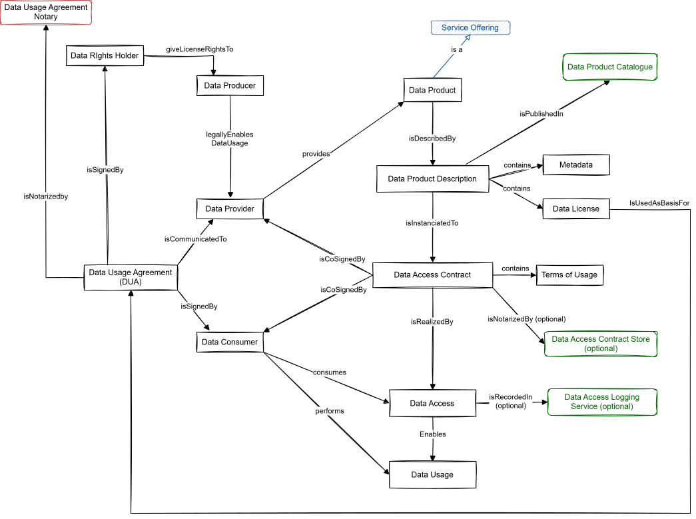
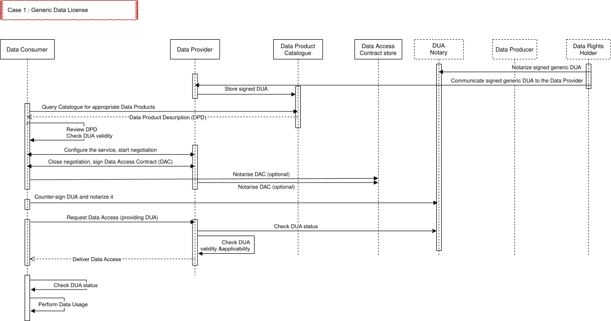
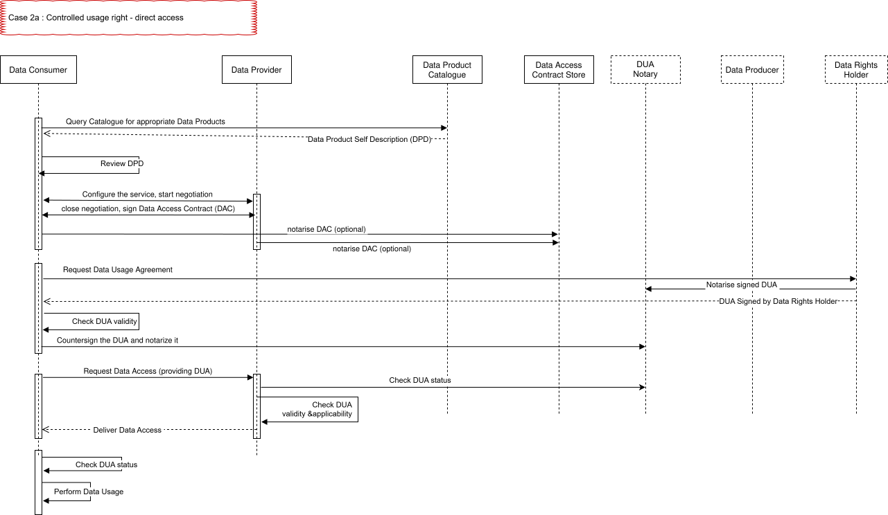
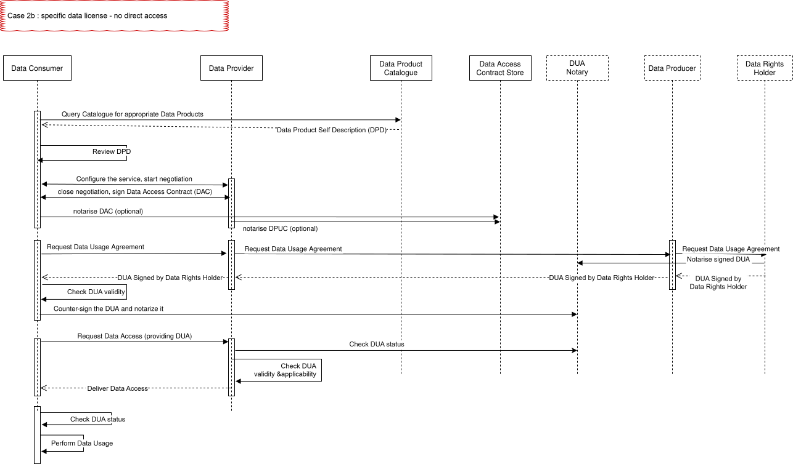
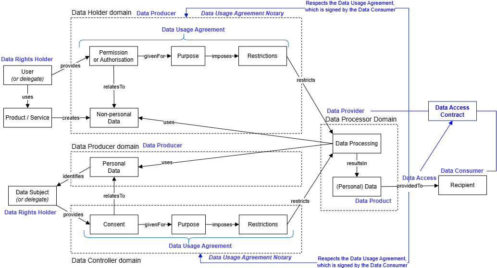

# 3. 데이터 제품(Data Product)[¶](https://docs.gaia-x.eu/technical-committee/data-exchange/25.07/data-product/#data-product "Permanent link")

디지털 전환을 촉진하고 혁신적인 서비스를 개발하려면 적시에 적절한 데이터를 확보해야 하며, 여러 출처의 데이터를 통합하여 가치 있는 인사이트를 도출해야 합니다.
그러나 대부분의 조직에서 데이터 공유는 이해관계자의 저항, 데이터 거버넌스 정책, 도구 부족, 규제 요건 대응 능력 부재 등으로 인해 지나치게 지연되고 있습니다.

- **데이터 생산자(Data Producer)** 입장에서, 개인 데이터 및 비개인 데이터 공유는 법적 위험(예: GDPR에 따라 당사자 동의 없이 개인 데이터를 공유하는 경우), 산업적 위험(예: 지식재산권이나 영업비밀이 포함된 데이터가 경쟁사에 유출되는 경우), 또는 평판·이미지 위험(예: 공유된 데이터가 오용될 경우 발생하는 개인정보 침해 비난)을 수반하는 반면, 데이터 공유로 인해 현지에서 얻을 수 있는 실질적인 이익은 거의 없습니다.
- **데이터 소비자(Data Consumer)** 입장에서, 적절한 활용 방법과 이에 따른 이용 제한 사항이 명확하고 공식적으로 명시되는 경우가 드물거나, 법적 형식으로만 표현되어 확인이 번거롭고 자동으로 강제하기가 어렵습니다.
- **법무·컴플라이언스 조직** 입장에서, 데이터 접근(Data Access) 및 거버넌스 프로세스는 종종 분산되어 있고, 적절한 데이터 이용 여부를 검증하는 작업은 복잡하고 인력이 많이 소요됩니다(즉, 수신한 데이터가 합법적으로 사용되고 있는지 확인하는 것은 복잡합니다).

이러한 복잡성으로 인해 지나치게 위험 회피적인 의사결정이 내려지는 경우가 많으며, "일단 중단하고 철저히 검토한다"는 방식으로 데이터 공유가 막혀 디지털 전환과 경쟁 우위 확보를 위한 비즈니스 기회를 놓치게 됩니다.

이러한 저항을 극복하려면 데이터 공유 프로세스 전반에 걸쳐 신뢰할 수 있는 메커니즘을 구축해야 합니다.
먼저, 원래의 데이터 권리 보유자(Data Rights Holder)가 자신의 데이터를 어떻게 사용해야 하는지를 표현할 수 있어야 하고, 해당 제약 조건이 제대로 적용될 것이라는 확신이 필요합니다.
또한 데이터 소비자는 데이터가 진본임을, 그리고 이용 권한이 합법적임을(즉, 데이터를 불법으로 이용하지 않음을) 확인할 수 있어야 합니다.
반대로, 데이터 제공자(Data Provider)는 데이터 소비자가 해당 데이터를 수신할 권한을 보유하고 있음을(즉, 데이터 제공이 합법적임을) 증명할 수 있어야 합니다.

Gaia-X의 데이터 제품(Data Product) 개념과 운영 모델은 이러한 메커니즘을 제공하며, 데이터 권리 보유자가 자신의 데이터를 누가 어떻게 사용하는지를 통제할 수 있도록 합니다(이를 *데이터 주권(data sovereignty)*이라 합니다). 또한 데이터에 관한 유럽 규제(GDPR 및 데이터 법(Data Act))의 컴플라이언스를 촉진하고 입증하는 메커니즘도 제공합니다.

## 3.1 데이터 제품 개념 모델(Data Product Conceptual Model)[¶](https://docs.gaia-x.eu/technical-committee/data-exchange/25.07/data-product/#data-product-conceptual-model "Permanent link")

*그림 3.1 - 데이터 제품 개념 모델*

`데이터 생산자(Data Producers)`가 `데이터 제공자(Data Providers)`에게 데이터를 제공하면, 데이터 제공자는 이를 조합하여 `데이터 소비자(Data Consumers)`가 활용할 `데이터 제품(Data Product)`을 구성합니다. 데이터 생산자는 GDPR 의미의 *데이터 소유자(data owner)* 또는 *데이터 처리자(data controller)*이거나, 데이터 법(Data Act) 의미의 *데이터 보유자(data holder)*일 수 있으며, 각 에코시스템별로 다른 종류의 데이터 생산자가 정의될 수 있습니다.

데이터 제품은 `데이터 제품 설명(Data Product Description)`으로 기술되며, 이는 [Data Product Ontology 클래스](https://gaia-x.gitlab.io/technical-committee/service-characteristics-working-group/service-characteristics/classes/DataProduct/)에 따른 유효한 데이터 제품 설명이어야 하고, 검색 가능한 `연합 데이터 카탈로그(Federated Data Catalogue)`에 저장됩니다.

데이터 제품 설명은 에코시스템에서 정의한 온톨로지를 사용하여 데이터의 범위, 형식, 품질 등을 기술하는 `메타데이터(Metadata)`를 포함하며, 비용 및 청구, 기술적 수단, 서비스 수준 협약(SLA) 등 서비스 오퍼링(Service Offering)의 계약적·운영적 측면에 관한 정보도 포함합니다.

데이터 소비자는 데이터 제품을 이용하기 전에 데이터 제공자와 `데이터 접근 계약(Data Access Contract, DAC)`을 협상하고 공동으로 서명합니다.
데이터 접근 계약은 데이터 제품 설명을 기반으로 하며, 서비스 구성 요소와 협상을 통해 상호 합의되고 강제 가능한 `이용 조건(Terms of Usage)`을 포함합니다. 따라서 데이터 제품 설명은 데이터 접근 계약의 템플릿 역할을 합니다.

데이터 접근 계약은 리카르디안 계약(Ricardian contract)으로, 인간과 기계 모두가 읽을 수 있으며, 암호화 서명을 통해 위변조가 방지되고, 계약의 대상인 데이터와 전자적으로 연결된 법적 계약입니다.
당사자들은 이 계약을 연합 `데이터 접근 계약 저장소(Data Access Contract Store)`에 (선택적으로) 공증 요청할 수 있습니다.

> **참고**
>
> 데이터 접근 계약(DAC)은 일반적으로 여러 부분으로 구성됩니다: (i) 에코시스템의 모든 참여자가 동의·서명하는 에코시스템 수준의 계약(에코시스템 정책 체계라고도 함), (ii) 제공자와 소비자 간 일련의 서비스에 대한 전반적인 계약 관계를 규정하는 기본 계약(Frame Contract), (iii) 주문한 서비스에 특화된 개별 계약.

계약이 양 당사자에 의해 체결·서명되면, 데이터 소비자는 데이터에 접근(`데이터 접근(Data Access)`)하고 이를 이용(`데이터 이용(Data Usage)`)할 수 있게 되며, 이로써 데이터 제품 접근 계약이 실현됩니다.
계약 협상을 통해 양 당사자는 `데이터 접근 로깅 서비스(Data Access Logging Service)` 사용에 합의할 수 있습니다(로그에는 청구에 필요한 정보, 서비스 수준 세부사항 등이 포함될 수 있으나, 청구 자체는 Gaia-X 범위 밖입니다).

데이터 제품 내 특정 데이터에 특정 라이선스가 부여된 경우, 데이터 제품 설명에는 데이터 이용 정책을 정의하는 `데이터 라이선스(Data License)`가 포함되어야 하며, 데이터 이용 전에 `데이터 권리 보유자(Data Rights Holder)`와 `데이터 소비자(Data Consumer)`가 서명한 `데이터 이용 계약(Data Usage Agreement, DUA)`으로 파생되어야 합니다. 데이터 이용 계약은 `데이터 이용 계약 공증인(Data Usage Agreement Notary, DUA Notary)`에 의해 공증되며, 언제든지 철회할 수 있습니다.

서명된 데이터 이용 계약은 데이터 제공자에게 전달되며, 데이터 제공자는 데이터 이용 요청이 들어올 때마다(특히 반복적인 데이터 접근의 경우) DUA가 철회되지 않았는지(DUA 공증인을 통해)와 DUA 제약 조건이 충족되는지를 확인해야 합니다.

서명된 데이터 이용 계약은 (a) 데이터 소비자에게 데이터 권리 보유자가 명시한 제약 조건에 따라 데이터를 이용할 수 있는 법적 권한을 부여하고, (b) 데이터 권리 보유자에게는 데이터 소비자가 해당 제약 조건을 준수하겠다고 약속한다는 확신을 제공합니다.

> **참고**
>
> 서명은 전자 서명(예: eIDAS 서명)이거나, DUA 공증인이 제공하는 특정 화면에서 "동의합니다" 버튼을 클릭하는 단순한 전자적 형식일 수 있습니다.

데이터 이용 계약(DUA)은 모든 종류의 라이선스 데이터를 포괄하는 일반적인 개념으로, GDPR의 *동의(Consent)* 개념과 EU 데이터 법(Data Act)의 *허가(Permission)* 개념을 모두 포함합니다.
법적 규제 대상 데이터(예: GDPR 또는 데이터 법)의 경우, 데이터 이용 계약에는 규제에서 요구하는 모든 정보(특히 이용 목적)가 포함되어야 합니다.

데이터 제품에 여러 데이터 권리 보유자의 데이터가 포함된 경우, 각 데이터 권리 보유자로부터 개별 데이터 이용 계약을 서명받아야 하며, 서명된 모든 데이터 이용 계약은 데이터 이용 전에 데이터 제공자에게 전달되어야 합니다.

> **참고**
>
> 데이터 접근 계약(DAC)과 데이터 이용 계약(DUA)은 목적과 관련 당사자 측면에서 서로 다릅니다.
>
> DAC는 데이터 제공자와 데이터 소비자 간에 체결되며, 기술적 구성, 청구, SLA, 계약 해지 조건 등 **서비스 제공**에 초점을 맞춥니다.
>
> DUA는 데이터 권리 보유자와 데이터 소비자 간에 체결되며, 데이터 제품에 포함된 **데이터의 이용 조건**에 초점을 맞춥니다.

## 3.2 데이터 라이선스와 데이터 이용 계약(Data License and Data Usage Agreement)[¶](https://docs.gaia-x.eu/technical-committee/data-exchange/25.07/data-product/#data-license-and-data-usage-agreement "Permanent link")

데이터 이용 계약(DUA)은 데이터 권리 보유자가 자신의 데이터를 누가 어떻게 사용하는지를 통제할 수 있게 합니다(이를 *데이터 주권(data sovereignty)*이라 합니다).

데이터 라이선스는 데이터 제품 내 데이터의 허용 또는 금지된 이용과 관련된 제약 조건들을 포함합니다. 데이터 이용 계약은 일반적으로 데이터 라이선스에서 파생되지만, 데이터 권리 보유자와 데이터 소비자 간 협상 결과에 따라 달라질 수 있습니다. 또한 데이터 이용 계약에는 데이터 소비자의 신원, 데이터 이용의 구체적인 목적, 계약 기간 등 추가 정보가 포함됩니다.

데이터 이용 계약은 두 가지 제약 조건 집합을 포함합니다: 데이터 접근 전에 데이터 제공자가 강제하는 *데이터 접근 전제조건(Data Access Prerequisites)*과 데이터 제공자의 범위 밖에 있으며 데이터 소비자가 데이터 이용 시 준수해야 하는 *데이터 이용 제약(Data Usage Constraints)*입니다. 예를 들어, 특정 ISO 인증을 보유한 연구 기관으로 데이터 접근을 제한하는 것은 데이터 제공자가 강제할 수 있는 반면, 특정 질병 관련 연구로 데이터 이용을 제한하는 것은 데이터 소비자만이 강제할 수 있습니다.

자동화 처리를 지원하기 위해 Gaia-X는 데이터 라이선스 제약 조건 표현에 W3C의 개방형 디지털 권리 언어(Open Digital Rights Language, ODRL) 사용을 의무화합니다(참조: https://www.w3.org/TR/odrl-model/) — 사용하는 온톨로지는 일반적으로 에코시스템에서 정의합니다.

데이터 라이선스는 "XYZ 보안 수준을 갖춘 비영리 인증 의료 기관이라면 누구든 내 데이터를 이용할 수 있습니다"와 같은 일반적인(generic) 형태이거나, "내 데이터는 데이터 소비자의 신원과 명시적 동의가 포함된 나와의 특정 DUA 서명을 통해서만 이용할 수 있습니다"와 같은 특정적인(specific) 형태일 수 있습니다.

첫 번째 경우(일반 라이선스)에는 데이터 권리 보유자가 서명한 DUA가 사전에 공증되며, 데이터 이용 전 데이터 권리 보유자와 추가 소통이 필요하지 않습니다. DUA 식별자는 데이터 제품 설명에 저장되며, 데이터 소비자는 해당 DUA에 서명하고 공증받은 후 식별자를 데이터 제공자에게 전달하기만 하면 됩니다.

두 번째 경우(특정 라이선스)에는 DUA를 작성하고 서명받기 위해 데이터 소비자 또는 데이터 제공자가 데이터 권리 보유자에게 연락해야 합니다.

자세한 내용은 [데이터 이용 운영 모델](#35-데이터-이용-운영-모델data-usage-operating-model) 섹션을 참조하세요.

## 3.3 DUA 검증 프로세스(DUA verification process)[¶](https://docs.gaia-x.eu/technical-committee/data-exchange/25.07/data-product/#dua-verification-process "Permanent link")

특정 데이터 이용에 관련된 당사자들은 다음 사항을 확인해야 합니다:

1. **DUA 유효성(DUA validity)**: DUA를 서명한 주체가 실제로 데이터 권리 보유자(또는 법적으로 위임된 대리인)인가?
2. **DUA 적용 가능성(DUA applicability)**: 데이터 소비자가 데이터에 접근할 자격이 있는가(즉, 계약에 명시된 *데이터 접근 전제조건*을 충족하는가)?
3. **DUA 상태(DUA status)**: DUA가 활성 상태인가(즉, 만료되거나 철회되지 않았는가)?

DUA 유효성 검증을 위해, DUA에는 데이터 권리 보유자가 DUA 서명 권한(즉, 데이터 이용 승인 권한)을 법적으로 보유함을 "증명"하는 검증 가능한 자격증명(Verifiable Credentials)이 포함되어야 합니다. 이러한 자격증명은 비즈니스 도메인에 특화된 비즈니스/법적 논리와 신뢰할 수 있는 출처에 의존할 수 있습니다. 예를 들어, 농부는 자신이 농부임을 증명하고 해당 토지를 소유하거나 임차하고 있는 경우에만 특정 토지 관련 데이터 공유에 동의할 수 있습니다.

DUA 적용 가능성 검증을 위해, 데이터 소비자는 DUA 내 각 ODRL 규칙에 대해 해당 규칙의 제약 조건을 충족함을 "증명"하는 검증 가능한 자격증명을 제공해야 합니다. 적용 가능성 검증을 용이하게 하기 위해, 데이터 제품 설명에 허용된 검증 가능한 자격증명 목록과 허용된 발급 기관을 명시하는 것이 권장됩니다.

데이터 제공자는 데이터 이용 요청이 있을 때마다 DUA 유효성, DUA 적용 가능성, DUA 상태를 확인해야 합니다.
데이터 소비자는 데이터를 이용하기 전에 DUA 유효성과 DUA 상태를 확인해야 합니다.

이러한 검증은 도메인별 로직을 필요로 하기 때문에 구현이 복잡할 수 있습니다. 따라서 대부분의 에코시스템은 DUA 공증인이 기본 공증 서비스 외에 DUA 유효성 및 DUA 적용 가능성 검증 서비스(정책 정보 포인트 역할)도 제공하도록 의무화할 가능성이 높습니다.

## 3.4 연쇄 계약과 잊혀질 권리(Cascading Agreement and Right to Oblivion)[¶](https://docs.gaia-x.eu/technical-committee/data-exchange/25.07/data-product/#cascading-agreement-and-right-to-oblivion "Permanent link")

위의 개념 모델은 재귀적으로 적용될 수 있습니다: 데이터 소비자는 데이터를 새로운 데이터 제품에 통합하여 다른 데이터 소비자들이 이용하게 할 수 있으며, 그 소비자들도 다시 새로운 데이터 제품을 만들 수 있습니다.
이를 통해 데이터 권리 보유자는 자신의 데이터를 누가 사용하는지 통제하고 이용 계약을 철회할 수 있는 편리한 메커니즘을 갖게 됩니다.

위의 모델은 데이터 이용 계약이 철회되면 데이터 제공자와 데이터 소비자 간의 후속 데이터 전달을 차단합니다. 따라서 이용 체인의 참여자 중 하나가 제 기능을 하지 못하면 철회 체인이 끊어지는 기존의 연쇄 메커니즘보다 더 강력한 방식입니다.

잊혀질 권리를 지원하기 위해, 각 참여자가 데이터 제공자에게 새로운 데이터 이용을 요청하지 않더라도 내부적으로 데이터를 재사용하기 전에 데이터 이용 계약의 유효성을 확인하도록 의무화하는 일반 정책을 에코시스템에서 정의하는 것이 권장됩니다.

참여자가 이 정책을 어떻게 구현할지는 자체 내부 데이터 관리 절차에 달려 있으며, 이는 Gaia-X의 범위를 벗어납니다.

## 3.5 데이터 이용 운영 모델(Data Usage Operating Model)[¶](https://docs.gaia-x.eu/technical-committee/data-exchange/25.07/data-product/#data-usage-operating-model "Permanent link")

Gaia-X의 전체 데이터 이용 프로세스는 의도적으로 데이터 제공자가 데이터 이용을 가능하게 하기 위해 배포한 기술 수단과 독립적으로 설계되었습니다. 구현 방식에는 API 호출 후 1회성 데이터 전송, 연속 데이터 스트림, 데이터 변경 시마다 콜백, 소비자가 제공하는 함수를 제공자 환경에서 실행(소비자는 데이터를 직접 보지 않고 결과만 수신) 등이 포함될 수 있습니다.
따라서 데이터 이용을 가능하게 하는 구체적인 기술 수단은 여기서 상세히 다루지 않습니다.

Gaia-X 데이터 이용 프로세스에서 가장 고유한 측면은 데이터 이용 계약(DUA) 서명과 관련된 부분입니다.
데이터 라이선스의 종류와 데이터 권리 보유자, 데이터 제공자, 데이터 소비자 간의 관계에 따라 다음과 같은 경우를 고려해야 합니다:

- **Case 1**: 일반 라이선스 - 데이터 권리 보유자가 누가 자신의 데이터를 사용하는지 알기를 원하지 않는 경우 (오픈 데이터는 데이터 권리 보유자가 서명한 DUA로 누구나 제약 없이 이용할 수 있는 일반 라이선스의 특수한 경우입니다)
- **Case 2a**: 특정 라이선스 - 데이터 소비자가 데이터 권리 보유자에게 접근할 수 있는 경우 (데이터 소비자가 데이터 권리 보유자의 데이터를 사용하여 해당 데이터 권리 보유자에게 서비스를 제공하는 경우가 일반적입니다. 예: 스포츠 트레이닝 앱이 스포츠 워치 제공자의 과거 모니터링 데이터를 활용하여 스포츠 코칭 조언을 제공하는 경우)
- **Case 2b**: 특정 라이선스 - 데이터 제공자는 데이터 권리 보유자에게 접근할 수 있지만, 데이터 소비자(예: 통계 목적으로 데이터를 이용하려는 소비자)는 접근할 수 없는 경우

일반 라이선스의 기본 운영 모델은 비교적 단순합니다:

*그림 3.5 Case 1 - 데이터 이용 운영 모델*

1. 데이터 권리 보유자가 일반 DUA에 서명하고 DUA 공증인을 통해 공증합니다. 이후 서명된 DUA를 데이터 제공자에게 전달하며, 데이터 제공자는 이를 카탈로그 내 데이터 제품 설명에 저장합니다(이 경우 일반 데이터 라이선스를 대체합니다).
2. 데이터 소비자가 데이터 제품 카탈로그를 조회하고, 데이터 라이선스를 포함한 데이터 제품 설명을 검토하여 자신의 요구에 맞는 데이터 제품을 선택합니다.
3. 데이터 소비자가 데이터 범위 및 운영 특성 측면에서 데이터 제품을 구성하고 데이터 제공자와 협상을 시작합니다.
4. 데이터 소비자와 데이터 제공자가 합의에 도달하면, 구성된 데이터 제품 설명에 서명하여 데이터 접근 계약(DAC)을 생성하고, 선택적으로 연합 데이터 접근 계약 저장소에 공증할 수 있습니다.
5. 데이터 소비자가 데이터 제품 설명에서 DUA를 가져와 공동 서명하고 DUA 공증인을 통해 공증합니다.
6. 데이터 소비자가 DUA를 제시하며 데이터 접근을 요청합니다. 데이터 제공자는 DUA의 유효성, 적용 가능성, 상태를 확인합니다. 모든 사항이 확인되면 인스턴스화된 데이터 제품을 활성화하여 실제 데이터 접근을 통한 데이터 이용이 가능해집니다.

데이터 제품에 특정 라이선스 데이터가 포함된 경우 운영 모델이 다소 복잡해집니다.

데이터 소비자가 데이터 권리 보유자에게 접근할 수 있는 경우(아래 Case 2a), 데이터 소비자가 직접 데이터 이용 계약을 요청할 수 있습니다. 이는 일반적으로 데이터 소비자가 데이터 권리 보유자에게 서비스를 제공하기 위해 그의 데이터를 이용하는 경우(예: 스포츠 트레이닝 앱이 스포츠 워치 제공자의 과거 모니터링 데이터를 활용하여 스포츠 코칭 서비스를 제공하는 경우)이거나, 데이터 권리 보유자가 데이터 제공자를 통해 연락처 정보를 데이터 소비자에게 공개하는 것에 동의하는 경우입니다. 그렇지 않은 경우, 데이터 이용 계약은 데이터 제공자가 수집해야 합니다.

*그림 3.5 Case 2a - 데이터 이용 운영 모델*

1. 데이터 소비자가 데이터 제품 카탈로그를 조회하고, 데이터 라이선스를 포함한 데이터 제품 설명을 검토하여 자신의 요구에 맞는 데이터 제품을 선택합니다.
2. 데이터 소비자가 데이터 범위 및 운영 특성 측면에서 데이터 제품을 구성하고 데이터 제공자와 협상을 시작합니다.
3. 데이터 제공자와 데이터 소비자가 협상을 마무리하고, 구성된 데이터 제품 설명에 서명하여 데이터 접근 계약(DAC)을 생성합니다. 선택적으로 연합 데이터 접근 저장소에 공증할 수 있습니다.
4. 데이터 소비자가 데이터 제품 라이선스에서 데이터 이용 계약 템플릿을 추출하고, 자신의 신원·데이터 이용 방법·목적 등 구체적인 정보를 기입한 후 데이터 권리 보유자에게 전달합니다. 데이터 권리 보유자가 이에 서명하고 DUA 공증인을 통해 공증한 뒤 데이터 소비자에게 반환합니다. 데이터 소비자는 DUA 유효성(즉, 데이터 권리 보유자가 해당 데이터에 대한 권리를 실제로 보유하는지 여부)을 확인하고, 공동 서명한 후 DUA 공증인을 통해 공증합니다.
5. 데이터 소비자가 DUA를 제시하며 데이터 접근을 요청합니다. 데이터 제공자는 DUA의 유효성, 적용 가능성, 상태를 확인합니다. 모든 사항이 확인되면 인스턴스화된 데이터 제품을 활성화하여 실제 데이터 접근을 통한 데이터 이용이 가능해집니다.

데이터 소비자가 데이터 권리 보유자에게 접근할 수 없는 경우(아래 Case 2b), 운영 모델은 유사하지만 4단계에서 데이터 이용 계약을 데이터 제공자를 통해(경우에 따라 데이터 생산자를 통해) 요청한다는 점이 다릅니다.

*그림 3.5 Case 2b - 데이터 이용 운영 모델*

1. 데이터 소비자가 데이터 제품 카탈로그를 조회하고, 데이터 라이선스를 포함한 데이터 제품 설명을 검토하여 자신의 요구에 맞는 데이터 제품을 선택합니다.
2. 데이터 소비자가 데이터 범위 및 운영 특성 측면에서 데이터 제품을 구성하고 데이터 제공자와 협상을 시작합니다.
3. 데이터 제공자와 데이터 소비자가 협상을 마무리하고, 구성된 데이터 제품 설명에 서명하여 데이터 접근 계약(DAC)을 생성합니다. 선택적으로 데이터 접근 계약 저장소에 공증할 수 있습니다.
4. 데이터 소비자가 데이터 제품 라이선스에서 데이터 이용 계약 템플릿을 추출하고, 자신의 신원·데이터 이용 방법·목적 등 구체적인 정보를 기입합니다. 데이터 소비자는 이 데이터 이용 계약을 데이터 제공자를 통해(일부 경우 데이터 생산자를 통해) 데이터 권리 보유자에게 전달합니다. 데이터 권리 보유자가 이에 서명하고 DUA 공증인을 통해 공증한 후, 데이터 제공자를 통해 데이터 소비자에게 반환합니다. 데이터 소비자는 DUA 유효성을 확인하고, 공동 서명한 후 DUA 공증인을 통해 공증합니다.
5. 데이터 소비자가 DUA를 제시하며 데이터 접근을 요청합니다. 데이터 제공자는 DUA의 유효성, 적용 가능성, 상태를 확인합니다. 모든 사항이 확인되면 인스턴스화된 데이터 제품을 활성화하여 실제 데이터 이용을 가능하게 하는 데이터 접근이 이루어집니다.

> **참고**
>
> DUA 공증인은 DUA 유효성 및 적용 가능성 검증을 위한 추가 서비스를 제공할 수 있습니다. 이는 Gaia-X에서 의무화하지는 않지만, 다양한 당사자들에게 편리한 서비스가 될 것입니다. 특히 에코시스템 간 데이터 이용의 경우, 이러한 검증이 도메인 의존적이고 일부 에코시스템에서는 실행하기 복잡할 수 있기 때문입니다. DUA 공증인은 데이터 소비자를 위한 이용 라이선스 및 이용 목적 분석, 데이터 소비자 관리 팀을 위한 DUA 통계, 데이터 권리 보유자를 위한 DUA 대시보드 및 데이터 이용 통계(예: 더 이상 사용되지 않는 서명된 DUA) 등 추가 서비스도 제공할 수 있습니다.

## 3.6 Gaia-X 개념과 EU 데이터 규제 개념 간의 매핑(Mapping of Gaia-X Concepts with EU Data Regulation Concepts)[¶](https://docs.gaia-x.eu/technical-committee/data-exchange/25.07/data-product/#mapping-of-gaia-x-concepts-with-eu-data-regulation-concepts "Permanent link")

다음 표는 Gaia-X 개념과 데이터 관련 유럽 규제(GDPR 및 EU 데이터 법(DxA)) 내 개념 간의 매핑을 나타냅니다:

| **유럽 규제 개념** | **Gaia-X 개념** |
| --- | --- |
| GDPR의 데이터 처리자(data processor) | 데이터 제공자(Data Provider) |
| GDPR의 정보주체(data subject) / DxA의 이용자(user) | 데이터 권리 보유자(Data Rights Holder) |
| GDPR의 동의(consent) / DxA의 허가(permission) 또는 승인(authorization) | 데이터 이용 계약(Data Usage Agreement) |
| GDPR의 수신자(recipient) / DxA | 데이터 소비자(Data Consumer) |

다음 다이어그램은 이러한 관계를 상세히 나타냅니다(유럽 규제 개념: 검정색, Gaia-X 개념: 파란색):

*그림 3.6 - Gaia-X 개념과 EU 데이터 규제 개념 간의 매핑*

September 18, 2025

September 18, 2025
