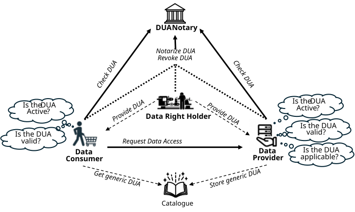
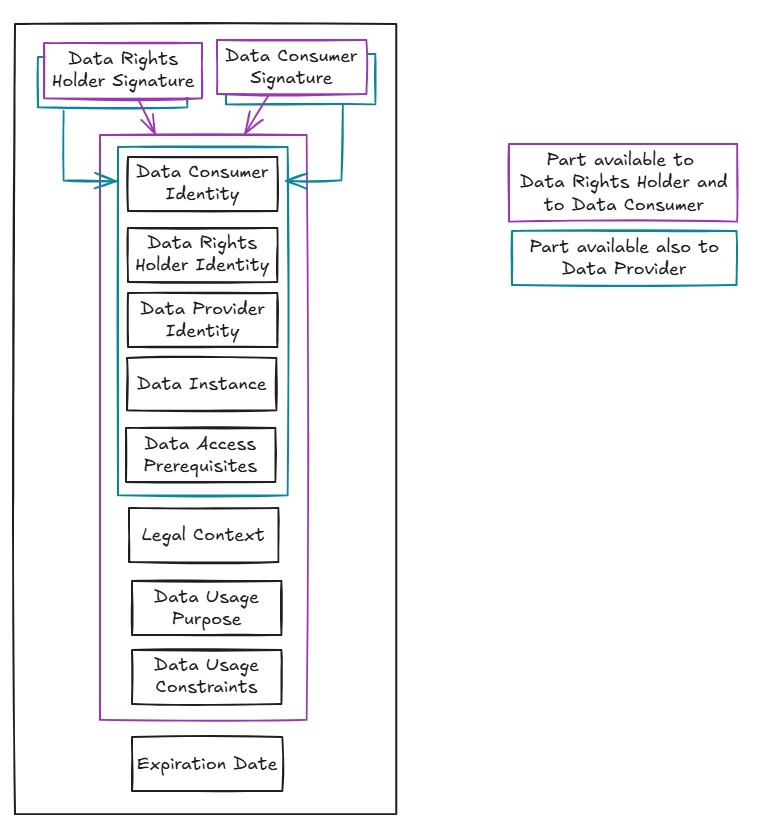
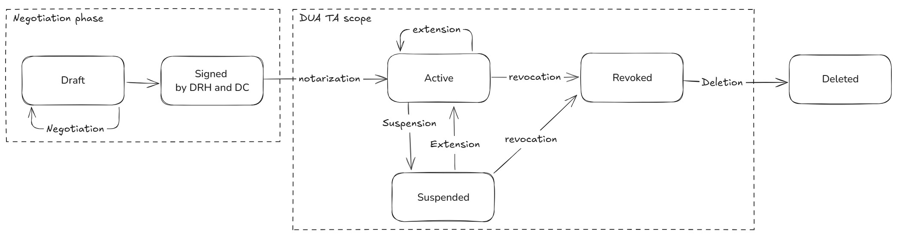
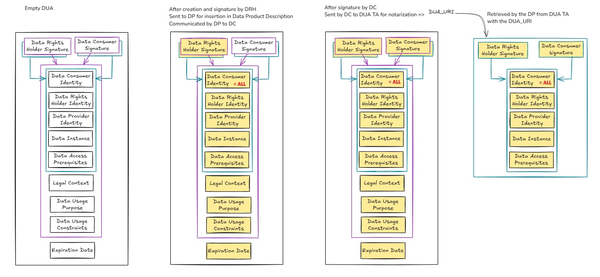
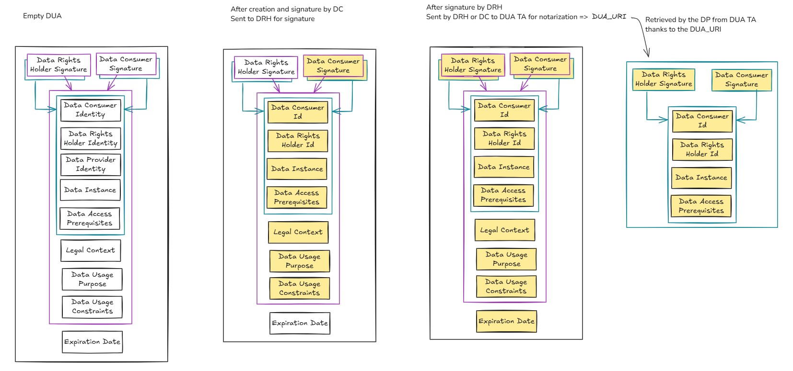
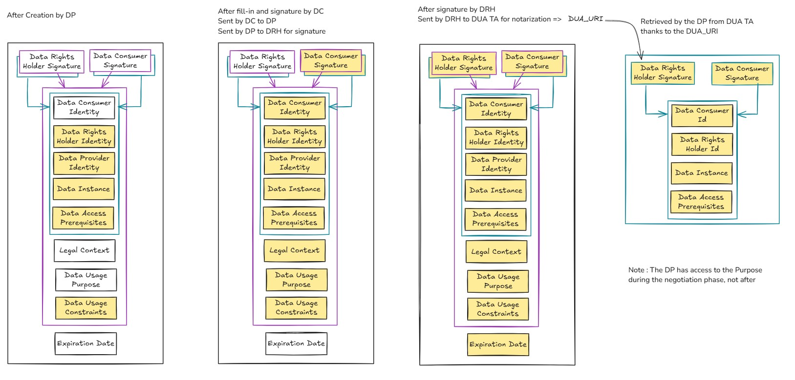

# 7. 데이터 이용 계약(Data Usage Agreement)[¶](https://docs.gaia-x.eu/technical-committee/data-exchange/25.07/data-usage-agreement/#data-usage-agreement "Permanent link")

데이터 이용 계약(Data Usage Agreement, DUA)은 Gaia-X 데이터 공유 모델의 핵심 개념입니다. DUA는 데이터 권리 보유자(Data Rights Holder)가 누가, 어떻게, 언제 자신의 데이터를 사용하는지를 통제할 수 있도록 하며(데이터 주권), 데이터 소비자(Data Consumer)에게는 데이터 권리 보유자가 지정한 제약 조건에 따라 데이터를 이용할 수 있는 공식적인 권한을 부여합니다.

Gaia-X DUA 프로토콜은 DUA의 구조, DUA의 생명주기, 그리고 데이터 공유 참여자들이 Gaia-X 데이터 공유 모델을 준수하기 위해 사용하는 기본 연산(primitives)을 정의합니다.

Gaia-X DUA 프로토콜은 다양한 참여자들이 Gaia-X 모델에 따라 신뢰 기반의 데이터 공유 트랜잭션에 참여할 수 있도록 지원합니다.

## 7.1 DUA 구조[¶](https://docs.gaia-x.eu/technical-committee/data-exchange/25.07/data-usage-agreement/#dua-structure "Permanent link")

(DRH: 데이터 권리 보유자(Data Rights Holder), DP: 데이터 제공자(Data Provider), DC: 데이터 소비자(Data Consumer), DUA: 데이터 이용 계약(Data Usage Agreement)).

DUA는 다음 항목을 포함합니다(DUA의 공식 LinkML 정의는 Gaia-X 온톨로지 - 부록 1 참고):

1. 데이터 소비자(DC) 식별자.
2. 데이터 권리 보유자(DRH) 식별자.
3. 데이터 제공자(DP) 식별자.
4. 데이터 인스턴스 설명(Data Instance Description): DRH가 이해할 수 있고 DP가 특정 데이터셋에 매핑할 수 있는 텍스트.
5. 데이터 접근 전제 조건(Data Access Prerequisites): DC가 충족해야 하며, DP가 DC에게 데이터 접근을 허용하기 전에 검증해야 하는 조건들의 집합.
6. 데이터 이용 목적(Data Usage Purpose): DRH와 DC 간에 합의된 데이터 이용의 구체적인 목적을 정의하는 텍스트.
7. 데이터 이용 제약 조건(Data Usage Constraints): DC가 데이터 제품(Data Product)의 데이터셋을 이용할 때 준수해야 하는 제약 조건들의 집합.
8. 법적 맥락(Legal Context): 위 항목들의 텍스트 버전(에코시스템이 위 항목들을 법원에서 법적으로 수용 가능한 텍스트 형식으로 신뢰 있게 변환하는 서비스를 제공한다고 가정).
9. 만료일(Expiration Date): 이 날짜 이후에는 데이터 이용이 더 이상 허가되지 않습니다.

DUA는 누구나 작성할 수 있으며, 에코시스템이 인정하는 신뢰 서비스 제공자(Trust Service Provider, TSP)를 통해 서명할 수 있습니다. 서명이 완료된 DUA는 변경이 불가합니다.

DUA는 에코시스템이 인정하는 DUA 공증자(DUA Notary)를 통해 공증받아야 합니다. 누구든지 DUA 공증자에게 특정 DUA의 공증을 요청할 수 있습니다. 실제로는 DRH 또는 DC가 공증을 요청하는 것이 일반적이지만, DUA 프로토콜에서 DRH를 지원하는 데이터 주권 자문 서비스(DUA 템플릿, DUA 대시보드 등)가 등장하는 것도 충분히 가능합니다.

5번과 6번 항목은 DRH 및/또는 DC가 기밀로 간주하여 DP에게 공개하지 않을 수 있습니다. 이에 따라 서명 집합이 두 가지로 구분됩니다: DC와 DRH를 위한 서명 집합(전체 DUA에 적용)과 DP에게 공개되는 항목에만 적용되는 서명 집합.

DC 서명과 DRH 서명에 사용되는 디지털 신원은 각각 DUA의 DC 식별자 및 DRH 식별자 필드와 일치해야 합니다. DC 식별자는 `ALL` 값으로 설정하여 데이터 접근 전제 조건을 충족하고 데이터 이용 제약 조건에 동의하는 모든 DC에게 데이터 공유를 허가할 수 있습니다. 이를 **범용 DUA(generic DUA)**라고 합니다.

만료일은 언제든지 DUA를 폐기(revoke)할 수 있도록 DUA의 서명 영역에서 제외됩니다. 만료일 관리(및 DUA 상태 관리)는 DUA 공증자가 에코시스템 수준에서 제공하는 신뢰 서비스입니다.

데이터 접근 전제 조건 필드는 다음으로 표현되는 조건들의 집합입니다:

- (선택 사항) 어휘를 정의하고 에코시스템 수준의 제약 조건을 표현하기 위한 ODRL 프로파일
- 특정 데이터 이용에 적용되는 구체적인 조건을 정의하는 ODRL 정책
- DC가 조건 충족을 증명하기 위해 제출해야 하는 허용 가능한 증거(Permissible Evidence)의 집합

허용 가능한 증거(Permissible Evidence)는 검증 가능한 클레임(Verifiable Claim) 템플릿과 허용된 발급자(Accepted Issuers) 집합으로 구성됩니다.
허용된 발급자는 에코시스템이 관리하는 발급자 카탈로그에 포함되어야 하며, 각 발급자별로 접근 방법과 허용된 VC 템플릿 목록이 명시됩니다. 이 카탈로그 외부의 발급자를 사용하면 DUA 적용 가능성 검증이 불가능해집니다.

## 7.2 DUA 생명주기[¶](https://docs.gaia-x.eu/technical-committee/data-exchange/25.07/data-usage-agreement/#dua-life-cycle "Permanent link")

DUA의 생명주기는 단순하며, 가능한 상태는 다음과 같습니다:

- **초안(Draft)**: DRH와 DC 간의 협상 단계
- **서명됨(Signed)**: DRH와 DC 양측이 서명한 상태
- **활성(Active)**: 공증 완료 후, 정지·폐기 전 및 만료일 이전 상태
- **정지됨(Suspended)**: 만료일이 오늘 이전인 경우 - 이 상태는 되돌릴 수 있음
- **폐기됨(Revoked)**: DUA의 유효성을 취소하고 데이터 접근을 차단하는 데 사용 - 이 상태는 되돌릴 수 없음
- **삭제됨(Deleted)**

DUA가 **활성(Active)** 상태라는 것이 계약의 유효성을 의미하지는 않습니다. 즉, DRH로서 DUA에 서명한 주체가 실제로 데이터 권리 보유자 또는 권한을 위임받은 대리인으로서 DUA에 서명할 자격이 있는지를 보장하지 않습니다. DUA 공증자는 공증 시 계약의 유효성을 검증하지 않으며, 공증 행위는 단지 DRH와 DC 간의 합의에 대한 제3자 기록에 불과합니다.

Gaia-X 데이터 공유 모델에서 식별된 다양한 사용 사례에 대응하기 위해, DRH와 DC가 DUA 필드를 합의하는 방식과 DUA 서명 순서에는 별도의 제약이 없습니다.

> **참고**
>
> DP가 카탈로그에서 해당 데이터 제품(Data Product)을 제거하더라도 DUA는 삭제(또는 폐기)되지 않습니다. 이는 DRH가 데이터 접근 단계 이후 DC 범위 내에서의 데이터 이용 방식을 계속 통제할 수 있도록 하기 위함입니다. DRH는 DC가 이미 접근한 데이터를 이후에 계속 이용하지 못하도록 DUA를 폐기할 수 있습니다.

| **DUA 상태** | **조건/규칙** |
| --- | --- |
| 활성(Active), 정지됨(Suspended), 폐기됨(Revoked) | 에코시스템이 인정한 DUA 공증자만이 처리할 수 있습니다. |
| 폐기됨(Revoked) | DRH와 DC 모두 DUA를 폐기할 수 있습니다. DRH는 데이터 주권 행사를 위해 폐기할 수 있으며, DC는 특정 날짜 이후 데이터에 접근하지 않았다는 증거(접근 로그 활성화 없이)를 확보하기 위해 폐기할 수 있습니다. |
| 삭제됨(Deleted) | DRH가 망각권(right of oblivion)을 행사할 수 있도록 합니다(DRH는 특정 DC와 특정 데이터를 공유했다는 사실을 DUA 공증자가 보관하지 않기를 원할 수 있습니다). |

## 7.3 DUA 기본 연산(Primitives)[¶](https://docs.gaia-x.eu/technical-committee/data-exchange/25.07/data-usage-agreement/#dua-primitives "Permanent link")

참고: 명시된 반환 값 외에도, 모든 기본 연산은 선택적으로 설명 텍스트와 함께 `Technical_Error` 값을 반환할 수 있습니다.

다음 기본 연산들은 모든 DUA 공증자에게 필수입니다:

`Notarize_DUA (DUA) -> KO` 또는 `DUA_URI`

- 누구나 요청 가능
- DUA 공증자는 DUA 구문 및 서명의 유효성을 검증합니다(즉, DUA에 서명한 주체의 디지털 신원이 DUA의 식별자 필드와 일치하는지 확인)
- DUA 공증자는 계약의 유효성을 검증하지 않습니다.

`Suspend_DUA (DUA_URI) -> OK` 또는 `KO`

- URI를 인식할 수 없는 경우 `KO` 반환
- DRH로부터의 요청만 수락하며, 그 외의 경우 `KO` 반환
- DUA가 활성(Active) 상태여야 하며, 그 외의 경우 `KO` 반환
- 이 연산은 DUA의 만료일을 오늘로 설정합니다.

`Revoke_DUA (DUA_URI) -> OK` 또는 `KO`

- URI를 인식할 수 없는 경우 `KO` 반환
- DRH 또는 DC로부터의 요청만 수락하며, 그 외의 경우 `KO` 반환
- DUA가 활성(Active) 또는 정지됨(Suspended) 상태여야 하며(즉, 이미 폐기된 상태가 아니어야 함), 그 외의 경우 `KO` 반환
- 이 연산은 DUA의 만료일을 오늘로 설정합니다.

`Extend_DUA (DUA_URI, End_Date) -> OK` 또는 `KO`

- URI를 인식할 수 없는 경우 `KO` 반환
- DRH로부터의 요청만 수락하며, 그 외의 경우 `KO` 반환
- 활성(Active) 또는 정지됨(Suspended) 상태의 DUA에 적용되며, 그 외의 경우 `KO` 반환
- `End_Date`가 오늘 이전인 경우 `KO` 반환(즉, 소급하여 DUA를 만료시키는 것은 불가능)
- DUA가 정지됨(Suspended) 상태인 경우, 다시 활성(Active) 상태로 전환됩니다.
- 이 연산은 DUA의 만료일을 지정된 `End_Date`로 설정합니다.

`Delete_DUA (DUA_URI) -> OK` 또는 `KO`

- URI를 인식할 수 없는 경우 `KO` 반환
- DRH로부터의 요청만 수락하며, 그 외의 경우 `KO` 반환
- 폐기됨(Revoked) 상태의 DUA에만 적용되며, 그 외의 경우 `KO` 반환
- 이 연산은 DUA 공증자 데이터베이스에서 DUA 및 모든 이력 로그를 제거하며, 재사용 방지를 위해 `DUA_URI`만 보관합니다.
- 해당 `DUA_URI`를 사용하는 모든 기본 연산 호출은 `KO` 응답을 반환합니다.

`Get_DUA_Content (DUA_URI) -> Signed_DUA` (DUA 공증자가 서명)

- URI를 인식할 수 없거나 DUA가 삭제됨(Deleted) 상태인 경우 `KO` 반환
- DRH, DC, DP로부터의 요청만 수락하며, 그 외의 경우 `KO` 반환
- DP로부터 요청을 받은 경우, DP에게 공개되는 부분만 반환합니다.
- 활성(Active), 정지됨(Suspended), 폐기됨(Revoked) 상태의 DUA에 적용됩니다.
- 참고: 에코시스템 규칙에 따라, 에코시스템 기관이 위임한 감사자(auditor)도 DUA 내용에 접근할 수 있을 수 있으나, 통상적으로 이 기본 연산이 아닌 별도의 수단을 사용합니다.

`Get_DUA_Status (DUA_URI) -> KO` 또는 `Signed_Status` (DUA 공증자가 서명)

- URI를 인식할 수 없거나 DUA가 삭제됨(Deleted) 상태인 경우 `KO` 반환
- DRH, DC, DP로부터의 요청만 수락하며, 그 외의 경우 `KO` 반환
- 상태 정보에는 현재 날짜와 `Active`, `Suspended`, `Revoked`, `Deleted` 중 하나가 포함됩니다.

`Get_DUA_History (DUA_URI) -> KO` 또는 `Signed_Log` (DUA 공증자가 서명)

- URI를 인식할 수 없거나 DUA가 삭제됨(Deleted) 상태인 경우 `KO` 반환
- DRH로부터의 요청만 수락하며, 그 외의 경우 `KO` 반환
- `DUA_URI`에 대한 기본 연산 호출 로그를 반환하며, 각 호출에 대해 호출자 식별자, 파라미터, 응답이 포함됩니다.

> **참고**
>
> 에코시스템 규칙에 따라, 에코시스템 기관이 위임한 감사자도 DUA 이력에 접근할 수 있을 수 있으나, 통상적으로 이 기본 연산이 아닌 별도의 수단을 사용합니다.

다음 기본 연산들은 선택 사항입니다:

`Check_DUA_Validity (DUA_URI) -> KO` 또는 `Signed_report` (DUA 공증자가 서명)

- URI를 인식할 수 없거나 DUA가 삭제됨(Deleted) 상태인 경우 `KO` 반환
- DRH, DC, DP로부터의 요청만 수락하며, 그 외의 경우 `KO` 반환
- 유효성 보고서에는 현재 날짜, 0에서 100 사이의 유효성 지수(validity index), 그리고 선택적으로 지수 산출을 위한 평가 보고서가 포함됩니다.
- 유효성 평가 규칙은 에코시스템이 정의합니다:
  지수 0은 일부 필수 규칙이 충족되지 않는다는 증거가 있음을 의미하고,
  지수 100은 DUA 공증자가 모든 필수 규칙이 충족된다는 증거를 수집했음을 의미하며, 중간 값은 에코시스템 규칙에 의해 정의됩니다.

`Check_DUA_Applicability (DUA_URI) -> KO` 또는 `Signed_report` (DUA 공증자가 서명)

- URI를 인식할 수 없거나 DUA가 삭제됨(Deleted) 상태인 경우 `KO` 반환
- DRH, DC, DP로부터의 요청만 수락하며, 그 외의 경우 `KO` 반환
- 적용 가능성 보고서에는 현재 날짜, 적용 가능성 상태, 선택적으로 평가 보고서가 포함됩니다. 적용 가능성 상태는 `Applicable`(적용 가능), `Not_Applicable`(적용 불가), `Unknown`(일부 허용된 발급자가 (일시적으로) 사용 불가한 경우 등 제공된 검증 가능한 클레임의 유효성을 확인할 수 없음) 중 하나입니다.

## 7.4 부록: DUA 협상 사례[¶](https://docs.gaia-x.eu/technical-committee/data-exchange/25.07/data-usage-agreement/#appendix-dua-negotiation-cases "Permanent link")

이 부록에서는 데이터 제품(Data Product) 운영 모델에서 식별된 3가지 주요 사례에 해당하는 DUA 협상 과정을 설명합니다.

**첫 번째 사례(범용 DUA)**는, DRH가 데이터 접근 및 이용 조건을 명시하고 싶지만, 누가 데이터를 이용하는지 직접 통제하지 않으려는 경우입니다. 예를 들어, 의료 데이터가 적절한 사이버 보안 수준을 갖춘 비영리 학술 기관의 연구 목적으로 사용되는 것에 동의하는 개인의 경우가 이에 해당합니다.

이 경우, DRH가 DC 식별자를 `ALL`로 설정하여 DUA를 미리 작성하고 서명합니다. 이 사전 작성된 DUA는 DP에게 전달되어 데이터 제품과 함께 보관됩니다. 데이터에 관심 있는 DC는 사전 작성된 DUA를 조회하고 접근 및 이용 조건을 검토한 후, DUA에 서명하고 공증을 위해 DUA 공증자에게 제출합니다.

**두 번째 사례(직접 접근)**는, DRH가 누가 데이터를 이용하는지 알고 통제하려 하며, DC가 DRH에 직접 접근할 수 있는 경우입니다. 예를 들어, 연결된 스마트워치 데이터를 담당 의사에게 제공하려는 개인의 경우가 이에 해당합니다.

이 경우, DC가 모든 항목을 포함한 DUA를 작성하고 서명한 후 DRH에게 전달합니다. 이후 DRH가 서명하며(양측 모두 수락 가능한 DUA를 얻기 위한 협상이 있을 수 있음), 최종적으로 DUA는 공증을 위해 DUA 공증자에게 제출됩니다.

**세 번째 사례(직접 접근 불가)**는, DRH가 누가 데이터를 이용하는지 알고 통제하려 하지만, DC가 DRH에 직접 접근할 수 없는 경우입니다. 예를 들어, 의료 데이터가 적절한 사이버 보안 수준을 갖춘 비영리 학술 기관의 연구 목적으로 사용되는 것에 동의하지만, 어떤 연구소가 자신의 데이터를 이용하는지 직접 확인하고 싶은 개인의 경우가 이에 해당합니다.

이 경우, DP가 DRH가 미리 정의한 접근 전제 조건과 이용 제약 조건을 사용하여 DUA를 작성합니다. 이 사전 작성된 DUA는 DC에게 전달되고, DC는 DC 식별자와 목적 항목을 작성하고 해당 법적 맥락을 생성한 후 DUA에 서명하여 DP에게 반환합니다. DP는 DUA를 DRH에게 전달하고, DRH가 서명한 후 DUA 공증자에게 공증을 요청합니다.

이 경우, DP는 협상 단계에서 데이터 이용 목적을 확인할 수 있습니다. 목적을 숨기고자 하는 DRH는 DP가 자신의 접근 주소를 DC에게 전달하도록 허가한 뒤, 두 번째 사례와 동일한 방식으로 DUA 협상을 진행해야 합니다.

## 7.5 부록: 명세의 기술 구현 권고 사항[¶](https://docs.gaia-x.eu/technical-committee/data-exchange/25.07/data-usage-agreement/#appendix-technical-implementation-recommendations-for-the-specifications "Permanent link")

데이터 이용 계약의 `LinkML` 공식 정의는 [Gaia-X 온톨로지](https://gaia-x.gitlab.io/technical-committee/service-characteristics-working-group/service-characteristics/classes/DataUsageAgreement/)에서 확인할 수 있습니다.

구현을 위해 다음 기술 명세의 적용이 검토되고 있습니다:

- [W3C Verifiable Credentials](https://www.w3.org/TR/vc-data-model-2.0/): DUA의 서명 처리
- [VC-JWT](https://www.w3.org/TR/vc-jose-cose/#securing-json-ld-verifiable-credentials-with-jose)
- [SD-JWT](https://datatracker.ietf.org/doc/html/draft-ietf-oauth-selective-disclosure-jwt): 위에서 설명한 5번 및 6번 항목을 선택적으로 공개하는 데 유용할 수 있음
- [Bitstring Status List](https://www.w3.org/TR/vc-bitstring-status-list/): DUA의 상태 관리
- [ODRL](https://www.w3.org/TR/odrl-model/): `데이터 접근 전제 조건(Data Access Prerequisites)` 및 `데이터 이용 제약 조건(Data Usage Constraints)` 정의에 활용 가능
- [ODRL VC Profile](https://gitlab.com/gaia-x/lab/policy-reasoning/odrl-vc-profile): ODRL 정책과 검증 가능한 크리덴셜(Verifiable Credentials) 간의 명확한 연결 제공

September 18, 2025

September 18, 2025
