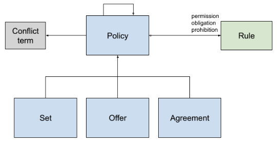
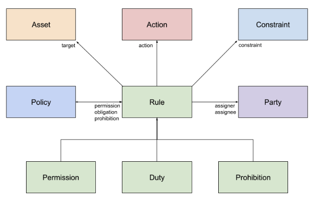
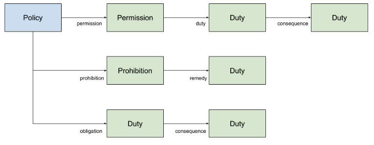
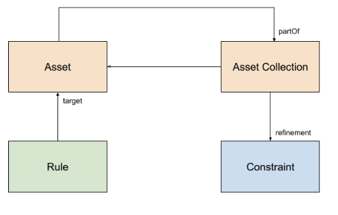
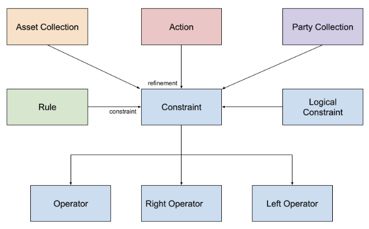
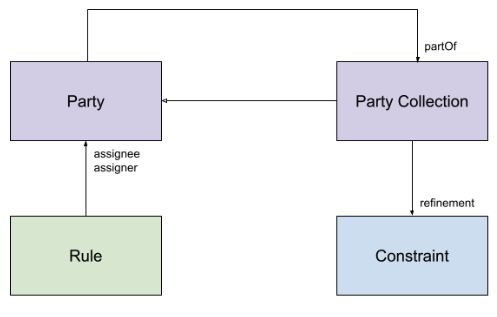

# 8. 정책(Policies)

## 8.1 데이터 교환을 위한 정책[¶](https://docs.gaia-x.eu/technical-committee/data-exchange/25.07/policies/#policies-for-data-exchange "Permanent link")

데이터 교환을 위한 정책은 데이터 및 데이터 교환에 대한 조건과 요건을 명시하는 다양한 측면을 반영해야 합니다. 따라서 이러한 정책은 각기 다른 범위와 목적을 가집니다.

1. **계약 정책(Contract Policies)**: 참여자 간의 계약에 명확하고 모호하지 않은 근거를 제공하기 위해 상호운용 가능한 정책입니다. 계약 정책은 기계 판독 가능(machine-readable)하고 사람이 읽을 수 있어야(human-readable) 합니다. 접근 정책(access policies)과 이용 정책(usage policies)을 포함해야 합니다. 이 목적을 위해 정책 정의 언어(Policy Definition Language)로 [ODRL](https://www.w3.org/TR/odrl-model/)을 사용합니다.
2. **런타임 정책(Runtime Policies)**: 계약 정책에서 파생되며, 참여자 시스템에서 계약 정책을 실행하는 데 사용됩니다. 실행을 위한 정책 정의 언어 옵션으로는 [Rego](https://www.openpolicyagent.org/docs/latest/policy-language/) 또는 [XACML](https://www.oasis-open.org/committees/tc_home.php?wg_abbrev=xacml)을 사용할 수 있습니다.

데이터 교환에서 주요 관심사는 계약 정책입니다. 계약은 계약 협상 시퀀스(contract negotiation sequence)를 통해 데이터 교환 참여자들 사이에서 협상됩니다. 그 결과로 양 당사자 간 서명된 계약이 생성되며, 이는 데이터 자산(data asset) 및 계약에 대한 검증 가능한 자격증명(Verifiable Credential) 형태의 명세서입니다.

계약 정책에는 최소한 다음 사항이 포함되어야 합니다:

- 데이터 자산, 관련 당사자 및 일반 조건에 대한 전반적인 설명
- 데이터 제공자(Data Provider) 측의 데이터 접근 요건 및 규칙을 명시한 접근 정책(Access Policies)
- 데이터 소비자(Data Consumer) 측의 의무(obligations)를 명시한 이용 정책(Usage Policies)
- 서명(Signatures)

**이용 제어(Usage Control)**는 기존 접근 제어(Access Control)의 확장 개념입니다. 데이터에 대해 발생해야 하거나 발생해서는 안 되는 제한 사항을 명시하고 시행하는 것을 의미합니다.

따라서 이용 제어는 데이터 접근(access)보다는 데이터 처리(processing)에 관한 요건, 즉 의무(obligations)와 관련이 있습니다. 이용 제어는 지적 재산권 보호, 규정 준수, 그리고 더 넓은 의미의 디지털 권리 관리(Digital Rights Management) 맥락에서 중요합니다.

**접근 제어(Access Control)**는 리소스에 대한 접근을 제한합니다. 권한 부여(authorization)는 리소스에 대한 접근 권한을 허가하는 프로세스입니다.

리소스 소유자는 엔드포인트에 대한 속성 기반 접근 제어(attribute-based access control) 정책을 정의하고, 리소스 접근 허가를 위해 주체(subject)가 증명해야 하는 속성 값을 지정합니다.

접근 제어와 달리, 이용 제어의 전반적인 목표는 접근이 허가된 이후의 데이터 이용 제한을 시행하는 것입니다. 따라서 이용 제어의 목적은 교환된 데이터에 정책을 결합하는 것입니다.
다음의 명세들([IDSA 이용 제어 포지션 페이퍼에서 발췌](https://internationaldataspaces.org/download/21053/))은 정책 클래스(policy classes)의 예시입니다:

- 데이터 이용 허용 (아무런 제한 없이 데이터 이용 제공)
- 시간 구간 제한 데이터 이용 (지정된 시간 구간 내에서만 데이터 이용 제공)
- 기간 제한 데이터 이용 (지정된 기간 동안만 데이터 이용 허용)
- 위치 제한 정책(Location Restricted Policy)
- 영구 데이터 판매 (1회 결제)
- 데이터 렌탈 (정기 결제)
- 역할 제한 데이터 이용(Role-restricted Data Usage)
- 목적 제한 데이터 이용 정책(Purpose-restricted Data Usage Policy)
- 이용 횟수 제한 (n회 데이터 이용 허용)
- 보안 수준 제한 정책 (지정된 보안 수준의 데이터 접근 허용)
- 이용 후 삭제 (지정된 타임스탬프에 삭제 조건으로 지정된 시간 구간 내 데이터 이용 허용)
- 제3자에게 배포 시 정책 첨부
- 암호화된 경우에만 배포

계약 정책을 표현하고 실행하기 위해서는 런타임 시 정책 평가에 필요한 다양한 정보가 요구됩니다. 이를 위해 최소한 세 가지 서로 다른 정보 모델이 필요합니다:

- 기본 탐색 및 신뢰 협상 정책을 위한 일반 에코시스템/Gaia-X 정책 데이터 모델
- 에코시스템의 모든 참여자가 이해해야 하는 에코시스템/산업별 데이터 모델
- 특정 계약의 데이터를 수신하지 않는 자에게는 관련 없지만, 특정 계약의 이용 제한을 이해해야 하는 자에게는 중요한 데이터 계약/데이터 자산별 데이터 모델

### 8.1.1 ODRL[¶](https://docs.gaia-x.eu/technical-committee/data-exchange/25.07/policies/#odrl "Permanent link")

#### 8.1.1.1 개념(Concepts)[¶](https://docs.gaia-x.eu/technical-committee/data-exchange/25.07/policies/#concepts "Permanent link")

참고 링크:

- [ODRL 정보 모델 2.2](https://www.w3.org/TR/odrl-model/)
- [ODRL 어휘 및 표현식 2.2](https://www.w3.org/TR/odrl-vocab/)
- [ODRL 구현 모범 사례](https://w3c.github.io/odrl/bp/)
- [ODRL 프로파일 모범 사례](https://w3c.github.io/odrl/profile-bp/)

개방형 디지털 권리 언어(Open Digital Rights Language, ODRL)는 콘텐츠 이용에 관한 설명 모델입니다. 허용, 금지, 의무 행위, 행위가 적용되는 리소스, 행위에 관여하는 행위자와 참여자, 이용 조건, 그리고 책임과 규정 등의 추가 정보를 기술합니다.

ODRL은 일반적으로 적용되는 접근 제어를 보완하는 이용 제어 기능의 구현을 가능하게 합니다. 이러한 이용 제어는 라이선스에서 비롯되며 데이터 이용 전에 적용되므로, 각 데이터와 그 이용 환경에 따라 달라집니다. 이용 제어의 예시로는 특정 기간 이용 허가, 처리 전 데이터 익명화, 특정 조건에서의 데이터 전송 금지 등이 있습니다.

주요 개념은 다음과 같습니다:

**정책(Policy)**: 정책은 규칙의 집합(허용, 금지 또는 의무를 포함할 수 있음)입니다. 세 가지 하위 클래스가 있습니다:

- **집합(Set)**: 규칙의 일반적인 컬렉션입니다.
- **오퍼(Offer)**: `assigner` 속성으로 지정된 행위자가 제공하는 규칙의 컬렉션입니다.
- **합의(Agreement)**: `assignee`로 지정된 행위자와 `assigner`로 지정된 행위자 간에 합의된 규칙의 컬렉션입니다.

[](./Policies - Data Exchange Document - 25.07 Release_files/Capture_d_écran_2023-04-21_à_08.48.20.png)

*그림 8.1.1.1a - 정책 클래스(Policy Classes)*

**규칙(Rule)**: 규칙은 정책의 규칙을 정의하는 기본 클래스입니다. 다음 속성을 가집니다:

- **asset**: 대상 리소스를 정의합니다.
- **action**: 리소스에 대해 수행할 작업을 정의합니다.
- **constraint**: 규칙의 유효성 조건을 정의합니다(예: date > 2020).
- **party**: 규칙에 관여하는 행위자를 정의합니다.

세 가지 하위 클래스가 있습니다:

- **허용(Permission)**: 이 규칙은 assignee가 해당 행위를 수행할 수 있도록 허가합니다.
- **의무(Duty)**: 이 규칙은 assignee가 해당 행위를 수행하도록 의무화합니다.
- **금지(Prohibition)**: 이 규칙은 assignee가 해당 행위를 수행하는 것을 금지합니다.

[](./Policies - Data Exchange Document - 25.07 Release_files/Capture_d_écran_2023-04-21_à_08.51.10.png)

*그림 8.1.1.1.b - 규칙 클래스(Rule Classes)*

의무(Duty) 클래스는 규칙을 명시하는 데에도 사용될 수 있습니다:

- 허용(permission) 내에서: 허가 부여 전에 충족되어야 하는 선행 조건을 명시합니다.
- 의무(obligation) 내에서: 의무가 이행되지 않을 경우 수행해야 하는 행위를 명시합니다.
- 금지(prohibition) 내에서: 금지가 준수되지 않을 경우 수행해야 하는 행위를 명시합니다.

[](./Policies - Data Exchange Document - 25.07 Release_files/Capture_d_écran_2023-04-21_à_08.53.41.png)

*그림 8.1.1.1.c - 의무 사용(Duty Uses)*

- **자산(Asset)**: 자산은 리소스 또는 리소스의 컬렉션입니다. 자산은 규칙이 적용되는 대상입니다. 컬렉션에는 규칙이 적용되는 요소를 필터링하기 위한 제약조건을 가질 수 있습니다.

[](./Policies - Data Exchange Document - 25.07 Release_files/Capture_d_écran_2023-04-21_à_08.55.35.png)

*그림 8.1.1.1.d - 자산 정의(Asset Definition)*

- **행위(Action)**: 행위는 자산에 대해 수행할 수 있는 작업입니다. ODRL은 두 가지 주요 행위인 "use(이용)"와 "transfer(이전)"를 정의하고 있습니다. 기타 행위는 특정 어휘나 프로파일에서 정의할 수 있습니다.
- **제약조건(Constraint)**: 제약조건은 다양한 컬렉션을 필터링하는 논리 표현식입니다. ODRL은 `or`, `xone`, `and`, `andSequence` 등의 논리 연산자를 정의합니다. 비교 연산자는 ODRL 어휘에 정의되어 있습니다: [ODRL 어휘 및 표현식 2.2 - 제약조건 연산자](https://docs.gaia-x.eu/technical-committee/data-exchange/25.07/policies/ODRL%20Vocabulary%20&%20Expression%202.2#Constraint%20Operators.)

[](./Policies - Data Exchange Document - 25.07 Release_files/Capture_d_écran_2023-04-21_à_08.58.39.png)

*그림 8.1.1.1.e - 행위와 제약조건(Action and Constraint)*

- **당사자(Party)**: 당사자는 규칙에서 기능적 역할을 가진 행위자 또는 행위자의 컬렉션입니다. 행위자는 `assignee`(규칙의 수신자) 또는 `assigner`(규칙의 발급자) 역할을 가질 수 있습니다. 컬렉션에는 규칙이 참조하는 요소를 필터링하기 위한 제약조건을 가질 수 있습니다.

[](./Policies - Data Exchange Document - 25.07 Release_files/Capture_d_écran_2023-04-21_à_09.00.02.png)

*그림 8.1.1.1.f - 당사자(Party)*

정책을 더 구체적으로 명시하기 위해 추가적인 메타데이터를 활용할 수 있습니다. 이 목적을 위해 더블린 코어 메타데이터(Dublin Core Metadata) 활용을 권장하며, 예시는 다음과 같습니다:

- dc:creator: 규칙의 작성자
- dc:description: 규칙 설명
- dc:issued: 발행일
- dc:modified: 최종 수정일
- dc:replaces: 대체되는 정책의 식별자
- dc:isReplacedBy: 현재 정책을 대체하는 정책의 식별자

정책은 기존 규칙을 재사용하기 위해 상속(inheritance)을 활용할 수 있습니다. 규칙 간 충돌이 발생할 경우, `conflict` 속성을 통해 원하는 동작을 지정할 수 있습니다. ODRL의 어휘는 프로파일을 사용하여 확장할 수 있으며, 예를 들어 추가 행위(actions)나 행위자 역할을 정의할 수 있습니다.

#### 8.1.1.2 예시(Examples)[¶](https://docs.gaia-x.eu/technical-committee/data-exchange/25.07/policies/#examples "Permanent link")

**파일 교환(File exchange)**:

이 ODRL 파일은 다음 용어를 사용합니다:

- 이용(Utilization): https://www.w3.org/TR/odrl-vocab/#term-use
- 파일 전송(File transfer): https://www.w3.org/TR/odrl-vocab/#term-distribute
- 결제(Payment): https://www.w3.org/TR/odrl-vocab/#term-compensate

```
{
 "@context": "https://www.w3.org/ns/odrl.jsonld",
 "@type": "Set",
 "uid": "https://data-exchange.com/policy:1",
 "permission": [
   {
     "target": "https://data-exchange.com/dataset/123",
     "assignee": "Data Consumer",
     "action": "use",
     "duty": [
       {
         "assigner": "Data Provider",
         "assignee": "Data Consumer",
         "action": [
           {
             "value": "compensate",
             "refinement": [
               {
                 "leftOperand": "payAmount",
                 "operator": "eq",
                 "rightOperand": { "@value": "500.00", "@type": "xsd:decimal" },
                 "unit": "https://dbpedia.org/resource/Euro"
               }
             ]
           }
         ]
       }
     ]
   }
 ],
 "obligation": [
   {
     "target": "https://data-exchange.com/dataset/123",
     "assigner": "Data Consumer",
     "assignee": "Data Provider",
     "action": "distribute"
   }
 ]
}
```

**라이선스 독점권(License Exclusivity)**: `ensureExclusivity` 용어를 사용하여 독점 라이선스를 지정할 수 있습니다.
`ensureExclusivity`의 목적은 자산에 적용된 규칙이 독점성을 유지하도록 보장하는 것입니다. `Duty`로 사용될 때, 이 독점성을 유지할 책임이 있는 assignee를 명시적으로 지정합니다.

```
{
 "@context": "https://www.w3.org/ns/odrl.jsonld",
 "@type": "Set",
 "uid": "https://data-exchange.com/policy:1010",
 "obligation": [
   {
     "target": "https://data-exchange.com/dataset/123",
     "assignee": "Data Provider",
     "action": "ensureExclusivity"
   }
 ]
}
```

**지역(Territories)**: `odrl:spatial` 용어를 사용하여 지역을 지정합니다.
`isAnyOf` 연산자를 사용하여 지정된 지역으로 이용을 제한합니다. 아래 예시에서 `isAnyOf`는 주어진 값이 제약조건의 우측 피연산자(right operand) 중 하나임을 나타냅니다.
여기서 우측 피연산자는 `fr`(프랑스)과 `es`(스페인)의 값 목록으로 정의됩니다. `odrl:spatial` 속성이 이 값들 중 하나와 일치하면 조건이 참(true)으로 평가됩니다.

```
{
 "@context": "https://www.w3.org/ns/odrl.jsonld",
 "@type": "Set",
 "uid": "https://data-exchange.com/policy:1010",
 "permission": [
   {
     "target": "https://data-exchange.com/dataset/123",
     "assignee": "Data Consumer",
     "action": "use",
     "constraint": [
       {
         "leftOperand": "odrl:spatial",
         "operator": "isAnyOf",
         "rightOperand": {
           "@list": [ "fr", "es" ]
         }
       }
     ]
   }
 ]
}
```

`isNoneOf` 연산자를 사용하여 지정된 지역 외부에서의 이용을 제한합니다. 이 연산자는 주어진 값이 제약조건의 우측 피연산자 집합에 포함되지 않는지 확인합니다. 아래 예시에서 `isNoneOf`는 데이터 소비자가 프랑스(`fr`)도 스페인(`es`)도 아닌 지역에서 데이터를 이용하는 것을 제한함을 나타냅니다.

```
{
 "@context": "https://www.w3.org/ns/odrl.jsonld",
 "@type": "Set",
 "uid": "https://data-exchange.com/policy:1010",
 "permission": [
   {
     "target": "https://data-exchange.com/dataset/123",
     "assignee": "Data Consumer",
     "action": "use",
     "constraint": [
       {
         "leftOperand": "odrl:spatial",
         "operator": "isNoneOf",
         "rightOperand": {
           "@list": [ "fr", "es" ]
         }
       }
     ]
   }
 ]
}
```

**산업 분야(Industries)**: `odrl:industry` 용어를 사용하여 비즈니스 업종을 지정합니다. 이를 통해 ODRL은 출판업이나 금융업과 같이 지정된 산업 맥락 내에서 행위를 적용할 수 있습니다.
`isAnyOf` 연산자를 사용하여 지정된 비즈니스 업종으로 이용을 제한합니다:

```
{
 "@context": "https://www.w3.org/ns/odrl.jsonld",
 "@type": "Set",
 "uid": "https://data-exchange.com/policy:1010",
 "permission": [
   {
     "target": "https://data-exchange.com/dataset/123",
     "assignee": "Data Consumer",
     "action": "use",
     "constraint": [
       {
         "leftOperand": "odrl:industry",
         "operator": "isAnyOf",
         "rightOperand": {
           "@list": [ "automotive" ]
         }
       }
     ]
   }
 ]
}
```

`isNoneOf` 연산자를 사용하여 지정된 산업 분야 외부에서의 이용을 제한합니다:

```
{
 "@context": "https://www.w3.org/ns/odrl.jsonld",
 "@type": "Set",
 "uid": "https://data-exchange.com/policy:1010",
 "permission": [
   {
     "target": "https://data-exchange.com/dataset/123",
     "assignee": "Data Consumer",
     "action": "use",
     "constraint": [
       {
         "leftOperand": "odrl:industry",
         "operator": "isNoneOf",
         "rightOperand": {
           "@list": [ "automotive" ]
         }
       }
     ]
   }
 ]
}
```

**이용 용도(Usages)**: `odrl:product` 용어를 사용하여 이용 용도를 분류하거나 제품 또는 서비스의 유형을 지정하며, 규칙 시행의 맥락을 제공합니다.
`isAnyOf` 연산자를 사용하여 지정된 이용 용도로 이용을 제한합니다:

```
{
 "@context": "https://www.w3.org/ns/odrl.jsonld",
 "@type": "Set",
 "uid": "https://data-exchange.com/policy:1010",
 "permission": [
   {
     "target": "https://data-exchange.com/dataset/123",
     "assignee": "Data Consumer",
     "action": "use",
     "constraint": [
       {
         "leftOperand": "odrl:product",
         "operator": "isAnyOf",
         "rightOperand": {
           "@list": [ "statistics" ]
         }
       }
     ]
   }
 ]
}
```

`isNoneOf` 연산자를 사용하여 지정된 이용 용도 외부에서의 이용을 제한합니다:

```
{
 "@context": "https://www.w3.org/ns/odrl.jsonld",
 "@type": "Set",
 "uid": "https://data-exchange.com/policy:1010",
 "permission": [
   {
     "target": "https://data-exchange.com/dataset/123",
     "assignee": "Data Consumer",
     "action": "use",
     "constraint": [
       {
         "leftOperand": "odrl:product",
         "operator": "isNoneOf",
         "rightOperand": {
           "@list": [ "statistics" ]
         }
       }
     ]
   }
 ]
}
```

**만료일(Expiration)**: `dateTime` 용어는 규칙의 행위가 수행되는 날짜(및 선택적으로 시간과 타임존)를 나타냅니다. 우측 피연산자(right operand) 값은 xmlschema에 정의된 `xsd:date` 또는 `xsd:dateTime`이어야 합니다. 이 어휘는 허용에 대한 만료일을 지정하는 데 사용됩니다:

```
{
 "@context": "https://www.w3.org/ns/odrl.jsonld",
 "@type": "Set",
 "uid": "https://data-exchange.com/policy:1010",
 "permission": [
   {
     "target": "https://data-exchange.com/dataset/123",
     "assignee": "Data Consumer",
     "action": "use",
     "constraint": [
       {
         "leftOperand": "dateTime",
         "operator": "lt",
         "rightOperand": {
           "@value": "2023-01-01",
           "@type": "xsd:date"
         }
       }
     ]
   }
 ]
}
```

**서브라이선싱(Sub licensing)**: `grantUse` 용어를 사용하여 서브라이선스 부여 가능성을 관리할 수 있습니다. `grantUse`의 주요 목적은 assignee가 제3자에게 자산의 이용을 허가할 수 있도록 하는 것입니다. assignee는 제3자의 자산 이용 방법을 규정하는 정책을 생성할 수 있습니다. 이 행위는 자산 소유자가 특정 조건 또는 제한 하에 다른 사람들이 자산을 이용하도록 허가하려 할 때 사용되며, 제3자 이용에 대한 추가 정책이나 제약조건을 지정하는 것을 포함할 수 있습니다.

서브라이선스 권한 없음:

```
{
 "@context": "https://www.w3.org/ns/odrl.jsonld",
 "@type": "Set",
 "uid": "https://data-exchange.com/policy:1010",
 "prohibition": [
   {
     "target": "https://data-exchange.com/dataset/123",
     "assignee": "Data Consumer",
     "action": "grantUse"
   }
 ]
}
```

제한 없는 서브라이선스 권한:

```
{
 "@context": "https://www.w3.org/ns/odrl.jsonld",
 "@type": "Set",
 "uid": "https://data-exchange.com/policy:1010",
 "permission": [
   {
     "target": "https://data-exchange.com/dataset/123",
     "assignee": "Data Consumer",
     "action": "grantUse"
   }
 ]
}
```

자회사에 대한 서브라이선스: `refinement` 속성을 사용하여 행위를 제한합니다:

```
{
 "@context": "https://www.w3.org/ns/odrl.jsonld",
 "@type": "Set",
 "uid": "https://data-exchange.com/policy:1010",
 "permission": [
   {
     "target": "https://data-exchange.com/dataset/123",
     "assignee": "Data Consumer",
     "action": [
       {
         "value": "grantUse",
         "refinement": [
           {
             "leftOperand": "recipient",
             "operator": "eq",
             "rightOperand": "subCompanies"
           }
         ]
       }
     ]
   }
 ]
}
```

다음 조건을 포함하는 예시:

- 지역 제한
- 산업 업종 제한
- 이용 용도 제한
- 기간 제한
- 자회사에 대한 서브라이선스 권한 (서브라이선스 재부여 없음)

```
{
 "@context": "https://www.w3.org/ns/odrl.jsonld",
 "@type": "Set",
 "uid": "https://data-exchange.com/policy:1",
 "permission": [
   {
     "target": "https://data-exchange.com/dataset/123",
     "assignee": "Data Consumer",
     "action": "use",
     "duty": [
       {
         "assigner": "Data Provider",
         "assignee": "Data Consumer",
         "action": [
           {
             "value": "compensate",
             "refinement": [
               {
                 "leftOperand": "payAmount",
                 "operator": "eq",
                 "rightOperand": { "@value": "500.00", "@type": "xsd:decimal" },
                 "unit": "https://dbpedia.org/resource/Euro"
               }
             ]
           }
         ]
       },
       {
         "action": "nextPolicy",
         "target": "https://data-exchange.com/policy:1010"
       }
     ],
     "constraint": [
       {
         "leftOperand": "odrl:spatial",
         "operator": "isAnyOf",
         "rightOperand": {
           "@list": [ "fr", "es" ]
         }
       },
       {
         "leftOperand": "odrl:industry",
         "operator": "isAnyOf",
         "rightOperand": {
           "@list": [ "automotive" ]
         }
       },
       {
         "leftOperand": "odrl:product",
         "operator": "isAnyOf",
         "rightOperand": {
           "@list": [ "statistics" ]
         }
       },
       {
         "leftOperand": "dateTime",
         "operator": "lt",
         "rightOperand": {
           "@value": "2023-01-01",
           "@type": "xsd:date"
         }
       }
     ]
   }
 ],
 "obligation": [
   {
     "target": "https://data-exchange.com/dataset/123",
     "assigner": "Data Consumer",
     "assignee": "Data Provider",
     "action": "distribute"
   }
 ]
}


{
 "@context": "https://www.w3.org/ns/odrl.jsonld",
 "@type": "Set",
 "uid": "https://data-exchange.com/policy:1010",
 "permission": [
   {
     "target": "https://data-exchange.com/dataset/123",
     "assignee": "Data Consumer",
     "action": [
       {
         "value": "grantUse",
         "refinement": [
           {
             "leftOperand": "recipient",
             "operator": "eq",
             "rightOperand": "subCompanies"
           }
         ]
       }
     ],
     "duty": [
       {
         "action": "nextPolicy",
         "target": "https://data-exchange.com/policy:nosublicence-123"
       }
     ]
   }
 ]
}


{
 "@context": "https://www.w3.org/ns/odrl.jsonld",
 "@type": "Set",
 "uid": "https://data-exchange.com/policy:nosublicence-123",
 "prohibition": [
   {
     "target": "https://data-exchange.com/dataset/123",
     "action": "grantUse"
   }
 ]
}
```

#### 8.1.1.3 검증 가능한 자격증명 클레임을 활용한 속성 기반 접근/이용 제어를 위한 ODRL 프로파일[¶](https://docs.gaia-x.eu/technical-committee/data-exchange/25.07/policies/#odrl-profile-for-attribute-based-accessusage-control-using-verifiable-credential-claims "Permanent link")

ODRL과 [검증 가능한 자격증명(Verifiable Credentials)](https://www.w3.org/TR/vc-data-model-2.0/)의 간극을 유용하고 상호운용 가능한 방식으로 연결하기 위해,
Gaia-X는 ODRL 정책에서 검증 가능한 자격증명을 참조하는 명확한 방법을 정의하는 ODRL 프로파일을 개발하고 있습니다.
구체적으로, 이를 통해 정책 발급자(assignors)가 assignee의 신뢰할 수 있고 검증 가능한 클레임(claims)을 활용하여 정책을 시행할 수 있게 되며, 정책 시행에 대한 신뢰와 확신을 높일 수 있습니다.

[이곳에 정의된](https://gitlab.com/gaia-x/lab/policy-reasoning/odrl-vc-profile) 이 프로파일은 몇 가지 속성을 정의합니다:

- `ovc:constraint`: `ovc:constraint`는 검증 가능한 자격증명을 사용하는 세부 조건(refinement)에 관한 것으로, 이 경우 assignee가 보유자(holder)이므로 제약조건은 반드시 `odrl:rule` 내의 `odrl:assignee` 안에 정의되어야 합니다. `ovc:leftOperand`, `ovc:credentialSubjectType`, `odrl:operator`, `odrl:rightOperand`를 반드시 포함해야 합니다.
- `ovc:leftOperand`: `ovc:leftOperand`는 평가할 W3C 검증 가능한 자격증명의 속성을 포함해야 하며, [JSONPath](https://datatracker.ietf.org/wg/jsonpath/about/) 형식으로 표현되어야 합니다.
- `ovc:credentialSubjectType`: `ovc:credentialSubjectType`은 평가할 W3C 검증 가능한 자격증명의 유형을 포함해야 하며, 네임스페이스 처리를 위해 관련 컨텍스트가 반드시 포함되어야 합니다.

###### 8.1.1.3.0.1 예시(Examples)[¶](https://docs.gaia-x.eu/technical-committee/data-exchange/25.07/policies/#examples_1 "Permanent link")

- Gaia-X 법인 참여자(Legal Participant) 검증 가능한 자격증명을 사용하여 위치 제한을 추가하는 예시

  ```
  {
    "@context": [
      "http://www.w3.org/ns/odrl.jsonld",
      { "gx" :"https://registry.lab.gaia-x.eu/development/api/trusted-shape-registry/v1/shapes/jsonld/trustframework#" },
      { "ovc": "https://w3id.org/gaia-x/ovc/1/" }
    ],
    "@type": "Offer",
    "uid": "http://example.com/policy/123",
    "profile": "https://w3id.org/gaia-x/ovc/1/",
    "permission": [
      {
        "@type": "Permission",
        "target": "http://example.com/asset/456",
        "action": "http://www.w3.org/ns/odrl/2/play",
        "assigner": "http://example.com/provider",
        "assignee": {
          "ovc:constraint": [
            {
              "ovc:leftOperand": "$.credentialSubject.gx:legalAddress.gx:countrySubdivisionCode",
              "operator": "http://www.w3.org/ns/odrl/2/isAnyOf",
              "rightOperand": [
                "FR-HDF",
                "BE-BRU"
              ],
              "ovc:credentialSubjectType": "gx:LegalParticipant"
            }
          ]
        }
      }
    ]
  }
  ```
- Gaia-X 법인 등록 번호(Legal Registration Number) 검증 가능한 자격증명을 사용하여 특정 VAT ID 번호를 요청하는 예시

  ```
  {
     "@context": [
        "http://www.w3.org/ns/odrl.jsonld",
        { "gx" :"https://registry.lab.gaia-x.eu/development/api/trusted-shape-registry/v1/shapes/jsonld/trustframework#" },
        { "ovc": "https://w3id.org/gaia-x/ovc/1/" }
     ],
     "@type": "Offer",
     "uid": "http://example.com/policy/124",
     "profile": "https://w3id.org/gaia-x/ovc/1/",
     "permission": [
        {
           "@type": "Permission",
           "target": "http://example.com/asset/456",
           "action": "http://www.w3.org/ns/odrl/2/display",
           "assigner": "http://example.com/provider",
           "assignee": {
              "ovc:constraint": [
                 {
                    "ovc:leftOperand": "$.credentialSubject.gx:vatID",
                    "operator": "http://www.w3.org/ns/odrl/2/eq",
                    "rightOperand": "BE0762747721",
                    "ovc:credentialSubjectType": "gx:legalRegistrationNumber"
                 }
              ]
           }
        }
     ]
  }
  ```
- 면허가 필요한 직종(트럭 운전사, 의사, 변호사 등)과 같이 특정 면허 소지자로 제한하는 예시

  ```
  {
     "@context": [
        "http://www.w3.org/ns/odrl.jsonld",
        { "ovc": "https://w3id.org/gaia-x/ovc/1/" },
        { "vdl": "https://w3id.org/vdl/v1"}
     ],
     "@type": "Offer",
     "uid": "http://example.com/policy/125",
     "profile": "https://w3id.org/gaia-x/ovc/1/",
     "permission": [
        {
           "@type": "Permission",
           "target": "http://example.com/asset/457",
           "action": "http://www.w3.org/ns/odrl/2/use",
           "assigner": "http://example.com/provider",
           "assignee": {
              "ovc:constraint": [
                 {
                    "ovc:leftOperand": "$.credentialSubject.driversLicense.driving_privileges.vehicle_category_code",
                    "operator": "http://www.w3.org/ns/odrl/2/eq",
                    "rightOperand": "C",
                    "ovc:credentialSubjectType": "vdl:Iso18013DriversLicense"
                 },
                 {
                    "ovc:leftOperand": "$.credentialSubject.driversLicense.driving_privileges.expiry_date",
                    "operator": "http://www.w3.org/ns/odrl/2/lt",
                    "rightOperand": {
                       "@value": "2025-01-01",
                       "@type": "xsd:date"
                    },
                    "ovc:credentialSubjectType": "vdl:Iso18013DriversLicense"
                 }
              ]
           }
        }
     ]
  }
  ```

ODRL 프로파일은 더 많은 기술적 세부 사항을 포함한 [참조 구현(Reference Implementation)](https://gitlab.com/gaia-x/lab/policy-reasoning/odrl-vc-profile#reference-implementation)도 정의하고 있습니다.

#### 8.1.1.4 기타 ODRL 프로파일(Other ODRL Profiles)[¶](https://docs.gaia-x.eu/technical-committee/data-exchange/25.07/policies/#other-odrl-profiles "Permanent link")

참고 사항으로, ODRL을 더욱 확장하기 위한 추가적인 ODRL 프로파일은 [이 W3C 커뮤니티 위키](https://www.w3.org/community/odrl/wiki/ODRL_Profiles)에서 확인할 수 있습니다.

September 18, 2025


September 18, 2025
