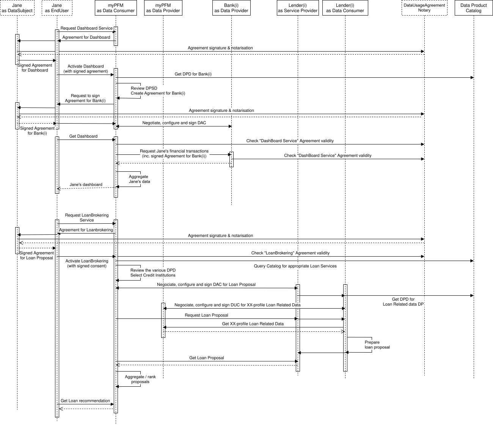

# 10. Annex 2 - Data Exchange example: the Personal Finance Management[¶](https://docs.gaia-x.eu/technical-committee/data-exchange/25.07/annex-2/#annex-2-data-exchange-example-the-personal-finance-management "Permanent link")

This example describes the various Gaia-X concepts using the Open Banking scenario of a Personal Finance Management service (PFM) in SaaS mode.

Suppose that the PFM service is proposed by a company called MyPFM to an end user Jane who has bank accounts in several banks: Bank(1), Bank(2)…
MyPFM is using services provided by the banks Bank(i) to get the banking transactions of Jane and then aggregates these bank statements to create Jane’s financial dashboard.

Jane is the End User and also the Data Rights Holder (as data subject per GDPR).

Bank(i) are Data Providers defining the Data Products (Service Offerings) delivering the banking transactions. They are also Resource Owners for the bank statements, which are Virtual Resources composing the Data Products, and as such are also the Data Producers.
The associated Resource Policies are in fact predefined by the PSD directive from the European Parliament. (note: this is not the way that consent management is currently put in place for DSP2 services - the process described below is adapted to the *Financial and Insurance Data Access* (FIDA) EU regulation draft issued in June 2023.)

MyPFM is the Data Consumer (Service Consumer) that consumes the data (Data Usage, Service Instances) provided by Bank(i) in order to create a financial dashboard and to offer it to Jane.

MyPFM is also likely consuming other Service Instances from a PaaS Provider in order to run its own code, such as the code implementing the dashboard creation.

Because sensitive personal information is involved, she has to sign a specific “contract” stating precisely how myPFM is authorized to use Jane’s data (e.g., authorized for establishing her financial dashboard), transmission to anybody else is prohibited except maybe for associating a payee and an expense category (i.e. payee X is a grocery, payee Y is a gas station, …).

Firstly, Jane will communicate her various bank account identifiers (IBAN) to myPFM. myPFM will use the Data Product catalogue to find out the appropriate services from each bank – we will suppose for simplicity’s sake that they are all named GetTransactionFromIBAN. PFM will review each Data Product Description to ensure that it is compatible with their needs. As sensitive personal information is involved, Bank(i) will require a signed agreement from Jane. The agreement template is included in the Data Product Description. (Note: ecosystems will likely have predefined standard consent templates in order to enable automatic and agile processing). myPFM will fill in the template and send it to Jane for her to sign it through a digital identity and digital signature provider trusted by Jane, myPFM and Bank(i).
myPFM and each Bank(i) will then configure the GetTransactionFromIBAN service for Jane and co-sign the contract.
myPFM can then request Jane’s transaction data (providing Jane’s signed Data Usage Agreement), process this data, and provide the financial dashboard to Jane.

Let us now suppose that myPFM also delivers a loan brokering service. To do so, myPFM provides a credit profile to loan institutions to receive credit proposals that they can rank and forward to Jane.

In this case, myPFM is both a Data Consumer from Bank(i) and a Data Provider to loan institutions Lender(i).
If Jane wants to use this service, she will first have to sign a new data usage agreement to authorize myPFM to communicate her credit profile (total income, loan capacity, purpose of the loan, …) to some loan institutions – this credit profile is anonymous and should not enable identifying Jane.
Then myPFM will query the Data Product Catalogue to find loan institutions providing such online loan services and will review the corresponding Data Product Description to check compliance with Jane’s data usage agreement and with myPFM policy.

With each selected Lender(i), myPFM will negotiate, configure, and sign the service contract. The terms of usage will not include Jane’s data usage agreement because the data transmitted to Lender(i) is anonymized at that stage. The terms of usage will include conditions specific to myPFM and Lender(i) business, for instance: myPFM is not authorized to communicate the credit proposal to other credit institutions for a given duration, myPFM guarantees that to their knowledge Jane is a real customer and not a data aggregator, Lender(i) commits to prepare a proposal within x hours, Lender(i) will pay myPFM some money if their offer is selected…

PFM will then call the getLoanProposal service from Lender(i). At that stage, no data is transmitted except an anonymous request identifier. In order to prepare a credit proposal, Lender(i) will have to get the credit profile associated with that identifier. For that Lender(i) will get, from the catalogue, the description of the getLoanRequestData service provided by myPFM, and Lender(i) will configure it and co-sign it. The terms of usage will still not involve Jane’s agreement but should include clauses at least as strong as those in Jane’s primary Data Usage Agreement, for instance, that the data shall be used only for the purpose of establishing a credit proposal and shall be deleted within 30 days if the proposal is not activated. Lender(i) will then get the data from myPFM by activating the getLoanRequestData service. At that stage, PFM acts as a Data Provider and Lender(i) as a Data Consumer. Lender(i) will then prepare the loan proposal and make it available to myPFM.

myPFM will then collect the various credit proposals, review them, and rank them to prepare a recommendation for Jane.

The formal operating model is given below:

September 18, 2025

September 18, 2025
